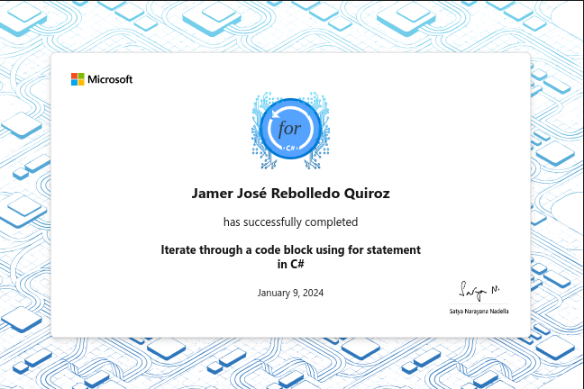

# Iterate through a code block using for statement in C\#

Use the for iteration statement to loop a pre-set number of times and control
the iteration process.

## Introduction

There are several ways to add looping logic in your application, and depending
on the context each provides a nuanced set of features that have both pros and
cons.

Suppose you're about to start working on an application that processes string
and numeric data using single dimensional and multi-dimensional arrays. After an
initial review, you realize that `foreach` statements do not support looping
logic that will be required in many cases. You'll need another approach for
iterating through multidimensional arrays, and for situations where `foreach`
loops don't provide the level of iteration control that's needed. You need to
gain experience using `for` statements if you're going to succeed on this
project.

By the end of this module, you'll be able to use for statements to implement
looping logic when foreach statements don't support the scenario.

### Learning objectives

In this module, you will:

- Use the for statement to loop through a code block.
- Examine the `for` statement syntax that enables you to control the iteration pattern.


## Exercise 1: Create and configure for iteration loops

On the surface, the `for` statement is another iteration statement that allows you
to iterate through a code block and thereby change the flow of execution of your
code. However, once we examine how each works, we can better identify the
nuances of each iteration statement and when to use them.

### What is the for statement?

The `for` statement iterates through a code block a specific number of times. This level of control makes the `for` statement unique among the other iteration statements. The `foreach` statement iterates through a block of code once for each item in a sequence of data like an array or collection. The `while` statement iterates through a block of code until a condition is met.

Furthermore, the for statement gives you much more control over the process of iteration by exposing the conditions for iteration.

In this exercise, you'll use the `for` statement, learning how to control the iteration's pre-condition, completion condition, its iteration pattern and more. Also, you'll learn of common use cases for the `for` statement.

### Write a basic for statement

The `for` statement is a compound statement that contains three expressions
separated by semicolons. The first expression is the initialization expression,
the second is the condition expression, and the third is the iteration
expression. The initialization expression is executed once before the loop
starts. The condition expression is evaluated before each iteration. If the
condition expression evaluates to `true`, the code block is executed. The
iteration expression is executed after each iteration.

The following code shows the basic syntax of a `for` statement:

```csharp
for (initialization; condition; iteration)
{
    // code block to be executed
}
```

### Code

[C#](./Exercises/Exercise1/Program.cs)

### Recap

Here are a few of the takeaways from this unit:

- The for iteration statement allows you to iterate through a block of code a specific number of times.
- The for iteration statement allows you to control every aspect of the iteration's mechanics by altering the three conditions inside the parenthesis: the initializer, condition, and iterator.
- It's common to use the for statement when you need to control how you want to iterate through each item in an array.
- If your code block has only one line of code, you can eliminate the curly braces and white space if you wish.


## Exercise 2: Complete a challenge activity using for and if statements

### FizzBuzz challenge

FizzBuzz is a popular coding challenge and interview question. It exercises your
understanding of the `for` statement, the `if` statement, the `%` remainder operator,
and your command of basic logic.

### Code challenge - implement the FizzBuzz challenge rules

Here are the FizzBuzz rules that you need to implement in your code project:

- Output values from 1 to 100, one number per line, inside the code block of an iteration statement.
- When the current value is divisible by 3, print the term Fizz next to the number.
- When the current value is divisible by 5, print the term Buzz next to the number.
- When the current value is divisible by both 3 and 5, print the term FizzBuzz
next to the number.

### Code

[C#](./Exercises/Exercise2/Program.cs)


## Review the solution for the for and if statements challenge activity

The following code shows the solution to the FizzBuzz challenge:

```csharp
for (int i = 1; i < 101; i++)
{
    if ((i % 3 == 0) && (i % 5 == 0))
        Console.WriteLine($"{i} - FizzBuzz");
    else if (i % 3 == 0)
        Console.WriteLine($"{i} - Fizz");
    else if (i % 5 == 0)
        Console.WriteLine($"{i} - Buzz");
    else
        Console.WriteLine($"{i}");
}
```
This code is merely "one possible solution".

The `for` statement is important because it allows you to iterate through the code block 100 times.

The `if-elseif-else` allows you to check for the divisors of 3 and 5.

The `%`, the mod operator, allows you to determine if 3 or 5 divide into another number without a remainder.

And the `&&` operator ensures that a number can be divided into both 3 and 5 for the `FizzBuzz` condition.

The code should produce the following output from 1 to 100.

## Summary

Your goal was to gain additional control over the iteration process by implementing the `for` statement in your code.

Modifying the initializer, condition, and iterator of a `for` statement provides precise control over the iteration logic.

Using the `for` statement, you iterated a hard-coded number of times, and used the `Length` on an array to iterate through the code block once for each item in the array. You modified the iterator, the condition for exiting the loop, and the pattern for iteration. You used the `break` keyword to exit out of the loop's body prematurely.

Without the iteration control provided by the `for` statement, you wouldn't be
able to complete certain coding tasks, such as looping through the data in a
multidimensional array.


