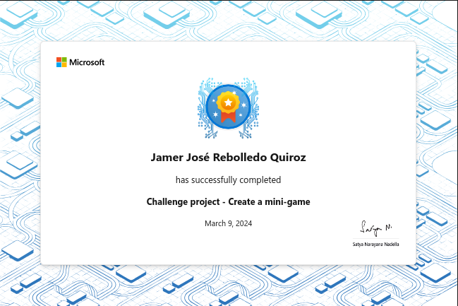

# Challenge project - Create a mini-game

Demonstrate your ability to create and use different methods to develop features
for a console mini-game.

## Introduction

Creating your own game is an exciting way to practice your programming skills.
Games rely heavily on processing user input to make dynamic decisions. Every
game must also have a set of defined rules that determine actions and events in
the game.

Suppose you want to create your own game. You might not be ready to develop a
fully featured game, so you decide to start as small as possible. You want to
move a character across the screen and make it consume an object. The object
consume can affect the state of the player. To keep the game going, you wanted
to regenerate the object in a new location once it has been consumed. You decide
that you'll need to use methods to keep your game code organized.

In this module, you'll develop the following features of a mini-game
application:

- A feature to determine if the player consumed the food
- A feature that updates player status depending on the food consumed
- A feature that pauses movement speed depending on the food consumed
- A feature to regenerate food in a new location
- An option to terminate the game if an unsupported character is pressed
- A feature to terminate the game if the Terminal window was resized

## Project specifications

The starter code project for this module contains a `Program.cs` file with the
following features:

- The code declares the following variables:
    - Variables to determine the size of the Terminal window.
    - Variables to track the locations of the player and food.
    - Arrays `states` and `foods` to provide available player and food
      appearances
    - Variables to track the current player and food appearance

- The code provides the following methods:
    - A method to determine if the Terminal window was resized.
    - A method to display a random food appearance at a random location.
    - A method that changes the player appearance to match the food consumed.
    - A method that temporarily freezes the player movement.
    - A method that moves the player according to directional input.
    - A method that sets up the initial game state.

- The code doesn't call the methods correctly to make the game playable. The
  following features are missing:
    - Code to determine if the player has consumed the food displayed.
    - Code to determine if the food consumed should freeze player movement.
    - Code to determine if the food consumed should increase player movement.
    - Code to increase movement speed.
    - Code to redisplay the food after it's consumed by the player.
    - Code to terminate execution if an unsupported key is entered.
    - Code to terminate execution if the terminal was resized.

Your goal in this challenge is to use the existing features and create the
missing features to make the game playable.

## Exercise 1 - Add code to end the game

Your goal is to develop a mini-game application. You need the game to end if the
user resized the Console window the game is running in. You also want to add an
option for the game to end if the user enters any nondirectional character.

### Specification

In this challenge exercise, you need to update the existing code to support an
option to terminate the gameplay if a nondirectional character is entered. You
also want to terminate the game if the terminal window was resized. You need to
locate the correct methods for your code to use.

#### Terminate on resize

This feature must

- Determine if the terminal was resized before allowing the game to continue
- Clear the Console and end the game if the terminal was resized
- Display the following message before ending the program: `Console was resized.
  Program exiting.`

#### Add optional termination

- Modify the existing `Move` method to support an optional parameter
- If enabled, the optional parameter should detect nondirectional key input
- If nondirectional input is detected, allow the game to terminate

## Exercise 2 - Make the player consume food

Your goal is to develop a mini-game application. The mini-game displays food
that the player can consume. You need to detect if the player has successfully
consumed the food, and if so, redisplay the food. You also want to change the
player appearance depending on what food was consumed.

### Specification

In this challenge exercise, you need to create a method that determines if the
player has consumed the food that was displayed. If the food was consumed, you
want to update the player's appearance and redisplay the food.

#### Check if the player consumed the food

- Create a method that uses the existing position variables of the player and
  food
- The method should return a value
- After the user moves the character, call your method to determine the
  following:
  - Whether or not to use the existing method that changes player appearance
  - Whether or not to use the existing method to redisplay the food

## Exercise 3 - Add code to modify movement

Your goal is to develop a mini-game application. Currently, your mini-game has
some basic gameplay capabilities! It terminates correctly, detects when the
player consumes food, changes the player appearance, and displays more food. Now
you want the food the player consumes to affect the player's ability to move.

### Specification

In this challenge exercise, you need to create a method that determines if the
player has consumed the food that affects their movement. When the player
consumes the food string with value #####, the appearance is updated to (X_X).
You'll add a feature to detect if the player appearance is (X_X), and if so,
temporarily prevent the player from moving.

You also want to add an optional feature that detects if the player appearance
is (^-^) and if so, increase or decrease the right and left movement speeds by a
value of 3 while that appearance is active. When the player state is ('-'), you
want the speed to return to normal. You want to make this feature optional since
consuming food in this state requires more collision detection than you want to
develop for now.

#### Check if the player should freeze

- Create a method that checks if the current player appearance is `(X_X)`
- The method should return a value
- Before allowing the user to move the character, call your method to determine
  the following:
  - Whether or not to use the existing method that freezes character movement
- Make sure the character is only frozen temporarily and the player can still
  move afterwards

#### Add an option to increase player speed

- Modify the existing `Move` method to support an optional movement speed
  parameter
- Use the parameter to increase or decrease right and left movement speed by `3`
- Create a method that checks if the current player appearance is `(^-^)`
- The method should return a value
- Call your method to determine if `Move` should use the movement speed
  parameter

## Code

[C#](./Challenge-project-Create-methods-in-CSharp-main/Starter/Program.cs)

## Summary

Your goal was to demonstrate the ability to develop features of an application
that achieve a design specification. You needed to decipher existing game code
to make informed decisions to make modifications and additions to the code.

By creating new methods, adding optional parameters, and using existing code,
you built a functional and fun mini-game!

Your ability to implement features of this mini-game application based on a
design specification demonstrates your ability to create and call methods.

## Achievement

