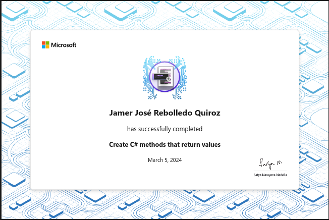

# Create C# methods that return values

Learn to create methods that return values

## Introduction

Methods can provide return values after performing their tasks. By using
parameters and return types together, you can create streamlined methods that
receive input, perform a task, and provide output. This format allows you to
efficiently build functionality into your programs while maintaining clean,
readable code.

Suppose you need to create an application that uses many methods to perform
calculations on input values. You need a way to retrieve the results of the
calculations, and use those results throughout your program. You can do this by
creating methods with return values.

Consider a game where the player must fight enemies. The game contains some code
that determines if a character was hit whenever an `Update()` method is called.
The code might contain the following methods:

```csharp
void Update();

int[] GetEnemyCoordinates(string enemyId);
int[] GetDistanceFromHero(string enemyId);
int[] GetHeroCoordinates();

bool EnemyCanHitHero(string enemyId);
int GetEnemyDamageOutput(string enemyId);
void UpdateHeroHP(int damage);
```

Looking at the method signatures, you can imagine how the input and output of
each method can be used across the program. The methods also make the game code
more robust since each one has return values that can be used for different
types of scenarios.

Capturing return values from methods is incredibly useful for all sorts of
applications. In this module, you'll learn more about method execution and
working with method return types.

### Learning objectives

In this module, you will:

- Understand return types
- Learn more about the return keyword
- Learn more about capturing method return values

## Exercise 1 - Understand return type syntax

Not only can methods perform operations, they can return a value as well.
Methods can return a value by including the return type in the method signature.
Methods can return any data type, or they can return nothing at all. The return
type must always be specified before the method name.

Using `void` as the return type means the method only performs operations and
doesn't return a value. For example:

When a data type (such as `int`, `string`, `bool`, etc.) is used, the method
performs operations and then returns the specified type upon completion. Inside
the method, the keyword return is used to return the result. In void methods,
you can also use the return keyword to terminate the method.

In this exercise, you'll learn more about using the return keyword.

### Code

[C#](./Exercises/Exercise1/Program.cs)

### Recap

Here's what you've learned about the `return` keyword so far:

- Methods can return a value by specifying the return data type, or void for no
  return value
- The return keyword can be used with variables, literals, and expressions
- The value returned from a method must match the specified return type
- Data returned from methods can be captured and used by the caller of the
  method

## Exercise 2 - Return numbers from methods

You might often need to return numbers from methods and use the results for
other tasks. In this brief exercise, you'll practice returning `int` and
`double` data types, and capturing the return values.

### Code

[C#](./Exercises/Exercise2/Program.cs)


## Exercise 3 - Return strings from methods

You may often find that you need to write a method that returns a string. For
example, you may want to retrieve a string from a set of data or modify a string
in some way. In this exercise, you'll gain some experience working with strings
in methods while practicing a common interview question.

### Code

[C#](./Exercises/Exercise3/Program.cs)


## Exercise 4 - Return Booleans from methods

Methods with Boolean return types can be simple but are useful in consolidating
code. Methods that return `bool` values can be called to evaluate data input
anywhere, in `if` statements, in variable declarations, and more. In this
exercise, you'll gain some experience creating and using Boolean return type
methods.

### Code

[C#](./Exercises/Exercise4/Program.cs)


## Exercise 5 - Return arrays from methods

When developing applications, you'll often need to build and modify sets of
data. Methods are useful for performing operations on data, and they're
especially powerful tools for building the data sets themselves. Developing
methods to create arrays representing your data set helps to keep your code
reusable, organized, and simplified. In this exercise, you'll practice returning
arrays from methods.

### Code

[C#](./Exercises/Exercise5/Program.cs)


## Exercise 6 - Complete the challenge to add methods to make the game playable

### Dice mini-game challenge

Your challenge is to design a mini-game. The game should select a target number
that is a random number between one and five (inclusive). The player must roll a
six-sided dice. To win, the player must roll a number greater than the target
number. At the end of each round, the player should be asked if they would like
to play again, and the game should continue or terminate accordingly.

In this challenge, you're given some starting code. You must determine what
methods to create, their parameters, and their return types.

### Code

[C#](./Exercises/Exercise6/Program.cs)

### Review

The following code is a possible solution to the challenge:

```csharp
Random random = new Random();

Console.WriteLine("Would you like to play? (Y/N)");
if (ShouldPlay())
{
    PlayGame();
}

bool ShouldPlay()
{
    string response = Console.ReadLine();
    return response.ToLower().Equals("y");
}

void PlayGame()
{
    var play = true;

    while (play) {
        var target = GetTarget();
        var roll = RollDice();

        Console.WriteLine($"Roll a number greater than {target} to win!");
        Console.WriteLine($"You rolled a {roll}");
        Console.WriteLine(WinOrLose(roll, target));
        Console.WriteLine("\nPlay again? (Y/N)");

        play = ShouldPlay();
    }
}

int GetTarget()
{
    return random.Next(1, 6);
}

int RollDice()
{
    return random.Next(1, 7);
}

string WinOrLose(int roll, int target)
{
    if (roll > target)
    {
        return "You win!";
    }
    return "You lose!";
}
```

## Summary

Your goal in this module was to understand how the `return` keyword affects method
execution and practice using different expressions in `return` statements. You
also learned how to capture and use values returned from methods. You even
gained experience using return types while practicing some common coding
interview questions.

## Achievement


