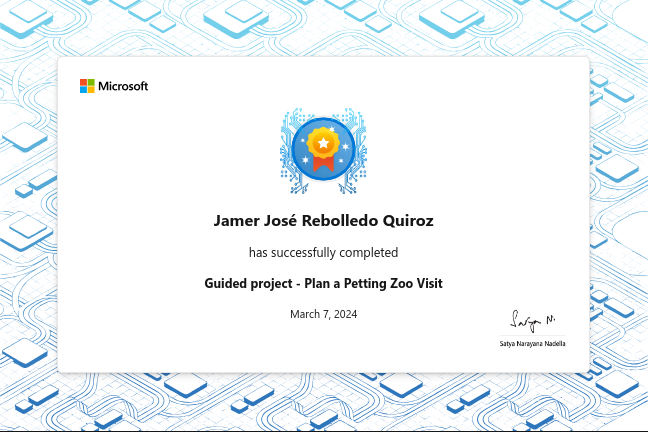

# Guided project - Plan a Petting Zoo Visit

Demonstrate your ability to develop a console app that relies on methods with
different parameters and return values to coordinate a visit to the petting zoo.

## Introduction

Methods are a fundamental programming concept. They provide code reusability,
improve readability, and reduce the size of your code. Methods help you break
down complex problems into modularized tasks, and help organize your code. Now
that you've learned about methods, you're ready to start developing more
functionality into your programs!

Suppose you're an event coordinator for a petting zoo. You must regularly
coordinate visits from different schools and organize animal visits for several
groups of students. You decide to write an application that helps you plan
school visits. The application divides students into groups and assigns them a
set of animals to visit. The students will rotate groups after they visit their
assigned animals. You decide to randomize the order animals so that each
school's visit is unique.

This module will guide you through the steps required to develop your petting
zoo application. Your code will use methods to plan a visit for three schools,
randomize the order of animals, assign students to groups, and display the
results. You'll use methods that accept parameters and return values, and you'll
include some optional parameters as well.

### Learning objectives

In this project, you will:

- Use methods to perform specific tasks
- Create methods that accept require and optional parameters
- Use values returned from methods

## Prepare for guided project

You'll be using Visual Studio Code to develop an application that relies on
different methods to perform a task. Some methods use optional parameters and
return values. Here, you'll find the overall goals of the project and how you'll
build and test your application. You'll also set up your development environment
using some Starter code.

### Project overview

You're developing an application for the Contoso Petting Zoo that coordinates
school visits. The Contoso Petting Zoo is home to 18 different species of
animals. At the zoo, visiting students are assigned to groups, and each group
has a set of animals assigned to it. After visiting their set of animals, the
students will rotate groups until they've seen all the animals at the petting
zoo.

By default, the students are divided into 6 groups. However, there are some
classes that have a small or large number of students, so the number of groups
must be adjusted accordingly. The animals should also be randomly assigned to
each group, so as to keep the experience unique.

The design specification for the Contoso Petting Zoo application is as follows:

- There are currently three visiting schools

    - School A has six visiting groups (the default number)
    - School B has three visiting groups
    - School C has two visiting groups

- For each visiting school, perform the following tasks

  - Randomize the animals
  - Assign the animals to the correct number of groups
  - Print the school name
  - Print the animal groups

## Exercise 1 - Plan your code using methods

In this first step of your development process, you'll begin planning your
application through pseudo-code. You'll identify the steps and methods that are
needed to complete the task. You also need to consider the input and output of
these methods as well. Preparing methods via pseudo-code is a helpful step in
any coding task, and can help you develop bug-free code quickly.

## Exercise 2 - Create a method to shuffle an array

In this step, you'll develop the code to complete your first subtask, which is
to randomize the petting zoo animals. Recall that you referenced a method
`RandomizeAnimals()` in your pseudo-code.

### Shuffle an array

Randomizing the elements of an array can seem like a daunting task. Before you
begin, take a moment to consider how you would swap the values of two variables,
`a` and `b`.

If you immediately assign `a = b`, you'll lose the original value of `a` and end
up with two variables equal to `b`. You need to use a temporary variable to
store the value of `a` before you can overwrite it. Let's use this concept to
begin your task.

## Exercise 3 - Create a method with an optional parameter

In this step, you'll develop the code to complete another subtask, which is to
assign the petting zoo animals to groups. Recall that you referenced a method
`AssignGroup()` in your pseudo-code.

## Exercise 4 - Create a method to display the results

In this step, you'll define the method to display the results of the animal
groups. You'll also complete the animal group assignments for the other visiting
schools.

## Code

[C#](./TestProject/Program.cs)

## Summary

Your goal was to build an application that uses methods to achieve a complex
task. You broke down the problem into modularized methods to create an
organized, readable solution. You also used parameters and return types to
complete your code.

## Achievement

