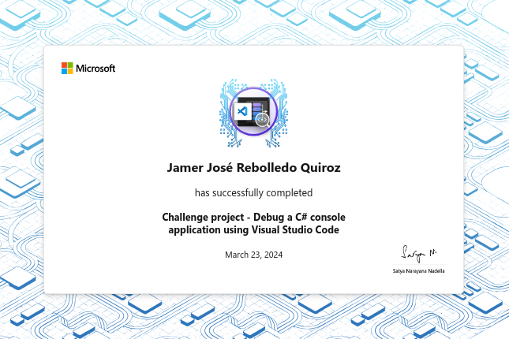

# Challenge project - Debug a C# console application using Visual Studio Code

In this module, you'll run an application to identify logic issues and then use
the Visual Studio Code debugger tools to isolate and fix the issue.

## Introduction

Visual Studio Code provides great code debugging tools for C# developers. You
can find debugger extensions for C# and other programming languages in the
Visual Studio Code Marketplace.

Suppose you're part of a team that's working on a cash register application.
You're developing a `MakeChange` method that manages the money till and
calculates the amount of change returned to the customer. The `MakeChange`
method tracks the number of bills of each denomination (1, 5, 10, and 20) that
are available in the till. Exceptions are thrown when the cash received doesn't
cover the cost of the item, and when the till isn't able to make change using
the available bills. The `MakeChange` method passed your initial code
verification tests, but a larger data sample exposed logic errors that need to
be isolated and fixed before the code can be released.

In this module, you complete the following tasks:

- Run the cash register application and review the generated output to identify
  a logic issue.
- Use the Visual Studio Code debugger tools to isolate and fix the issue.

By the end of this module, your `MakeChange` method will successfully balance
the money till during a simulation of daily transactions.

## Prepare

### Project specification

The Starter code project for this module includes a Program.cs file with the
following code features:

- Simulate transactions: the top-level statements configure application data and
  simulate a series of transactions using either a small `testData` array or a
  larger number of randomly generated transactions.
- Initialize the till: the `LoadTillEachMorning` method is used to configure the
  cash register till with a predefined number of bills in each denomination.
- Process transactions: the `MakeChange` method is used to manage the cash till
  during purchase transactions.
- Report till status: the `LogTillStatus` method is used to display the number
  of bills of each denomination currently in the till.
- Report till balance: the `TillAmountSummary` method is used display a message
  showing the amount of cash in the till.


The `MakeChange` method contains logic issues that prevent it from successfully
balancing the money till during simulated transactions. You need to use the
Visual Studio Code debugger tools to isolate and fix the logic issues.

To ensure that your `MakeChange` method is working correctly, your code must
verify a successfully balanced till under the following conditions:

- top-level statements simulate the transactions using randomly generated item
  costs.

- top-level statements generate random values for `itemCost` in the range `2 -
  49`.

- top-level statements simulate 100 transactions.

- the till is successfully balanced when the reported till value is equal to the
  expected till value. For example:

```plaintext
The till has 1184 dollars
Expected till value: 1184
```

## Exercise 1 - Use the test data to expose logic issues in a C# console application

The `MakeChange` method is able to process simulated transactions successfully
when using the `testData` array. However, logic issues are exposed when
simulating the transactions using a larger data set of randomly priced items.
This issue demonstrates the importance of thoroughly testing your applications.

### Specification

In this challenge exercise, you need to configure the variables used to simulate
transactions and verify that the transactions report includes the expected
discrepancies.

The following requirements apply to the simulated transactions:

- top-level statements simulate transactions using randomly generated item
  costs.
- top-level statements generate random values for `itemCost` in the range `2 -
  49`.
- top-level statements simulate 100 transactions.

The reported transaction output must include:

- A record of 100 attempted transactions.
- Instances of a message stating: "Could not make transaction:
  InvalidOperationException: Not enough money provided to complete the
  transaction."
- Instances of a message stating: "Could not make transaction:
  InvalidOperationException: The till is unable to make change for the cash
  provided."
- A discrepancy between the reported an expected till values.

## Exercise 2 - Use the Visual Studio Code debugger to isolate and fix logic issues in a C# console application

In this challenge exercise, you need to use the Visual Studio Code debugger
tools to isolate and fix the issues that are preventing the `MakeChange` method
from successfully balancing the till. Once your application is updated, you need
to verify your results.

### Specification

The following specification requirements apply to the simulated transactions:

- top-level statements simulate transactions using randomly generated item
  costs.
- top-level statements generate random values for itemCost in the range `2 - 49`.
- top-level statements simulate 100 transactions.

The reported transaction output must include:

- A record of 100 attempted transactions.
- Instances of a message stating: "Could not make transaction:
  InvalidOperationException: Not enough money provided to complete the
  transaction."
- Instances of a message stating: "Could not make transaction:
  InvalidOperationException: The till is unable to make change for the cash
  provided."
- A reported till value that's equal to the expected till value.

## Summary

Your goal was to demonstrate the ability to use the Visual Studio Code debugger tools for C# applications.

By configuring the debug environment and successfully debugging the cash register application, you demonstrated your ability to use the Visual Studio Code debugger tools for C#. You began by ensuring that the launch.json file was configured correctly to support your application. Then you ran the application, reviewed the generated output, and identified the logic issue. After that you used the Visual Studio Code debugger tools to isolate and fix the logic issues. When you were finished, you saved your updated application and ran the application to demonstrate that the application performed as intended.

Your ability to debug the cash register application demonstrates your ability to implement the Visual Studio Code debugger tools for C#.

## Achievement


