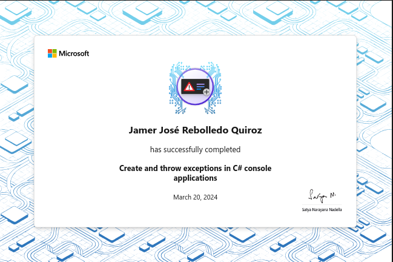

# Create and throw exceptions in C# console applications

Learn how to create exception objects, how to customize the properties of an
exception object, and the process for creating, throwing, and catching custom
exception objects in a C# application.

## Introduction

Exceptions can be thrown by your code when an issue or error condition is
encountered. Exception objects that describe an error are created and then
thrown with the `throw` keyword. When an exception is thrown by your code, the
runtime searches for the nearest `catch` clause that can handle the exception.

Suppose you're working on a data processing application for a company. The
application relies on business rules and specifications to ensure that purchase
order processing and inventory management tasks are completed appropriately. In
addition, the application must use specific language to inform the user when
data anomalies and other issues are encountered. Customized exceptions must be
thrown, caught, and reflected in the application's user interface when issues
are encountered. Business rules provide specific guidance in the following
categories:

- Data input requirements for the processes.
- Success and failure criteria for the processes.
- Sequence order requirements for the processes.
- Process failure reporting and mitigation requirements.

In this module, you learn how to create exception objects, how to customize the
properties of an exception object, and the process for creating, throwing, and
catching custom exception objects in a C# application.

By the end of this module, you'll be able to create, customize, throw, and catch
exception objects that satisfy the requirements for your application.

### Learning objectives

In this module, you will:

- Learn how exception objects are created and how to customize their property
  settings.
- Develop C# console applications that create and throw customized exception
  objects.
- Develop C# console applications that catch custom exception objects and manage
  exception property information.

## Examine how to create and throw exceptions in C#

.NET provides a hierarchy of exception classes that derive from the
`System.Exception` base class. C# applications can create and throw exceptions
of any exception type. Developers can also customize exception objects with
application specific information by assigning property values.

> [!NOTE]
> This module focuses on creating and throwing exceptions, and customizing
> exception objects. Creating custom exception classes is outside the scope of
> this module.

### Create an exception object

Creating and throwing exceptions from within your code is an important aspect of C# programming. The ability to generate an exception in response to a specific condition, issue, or error helps you to ensure the stability of your application.

The exception type that you create depends on the coding issue, and should match the intended purpose of the exception as closely as possible.

For example, suppose you're creating a method named `GraphData` that performs data analysis. The method receives a data array as an input parameter. The method is expecting the input data to be in a particular range. If the method receives data that's outside the expected range, it creates and throws an exception of type `ArgumentException`. The exception will be handled somewhere down the call stack by the code that's responsible for providing the data.

Here are some common exception types that you might use when creating an exception:

- `ArgumentException` or `ArgumentNullException`: Use these exception types when a method or constructor is called with an invalid argument value or null reference.
- `InvalidOperationException`: Use this exception type when the operating conditions of a method don't support the successful completion of a particular method call.
- `NotSupportedException`: Use this exception type when an operation or feature is not supported.
- `IOException`: Use this exception type when an input/output operation fails.
- `FormatException`: Use this exception type when the format of a string or data is incorrect.

The `new` keyword is used to create an instance of an exception. For example, you can create an instance of the `ArgumentException` exception type as follows:

```csharp
ArgumentException invalidArgumentException = new ArgumentException();
```

> [!NOTE]
> The Message property of an exception is readonly. Therefore, a custom Message
> property must be set when instantiating the object.

When customizing an exception object, it's important to provide clear error
messages that describe the problem and how to resolve it. You can also include
additional information such as stack traces and error codes to help users
correct the issue.

An exception object can also be created directly within a throw statement. For
example:

```csharp
throw new FormatException("FormatException: Calculations in process XYZ have been cancelled due to invalid data format.");
```

Some considerations to keep in mind when throwing an exception include:

The `Message` property should explain the reason for the exception. However,
information that's sensitive, or that represents a security concern shouldn't be
put in the message text. The `StackTrace` property is often used to track the
origin of the exception. This string property contains the name of the methods
on the current call stack, together with the file name and line number in each
method that's associated with the exception. A `StackTrace` object is created
automatically by the common language runtime (CLR) from the point of the `throw`
statement. Exceptions must be thrown from the point where the stack trace should
begin.

### When to throw an exception

Methods should throw an exception whenever they can't complete their intended
purpose. The exception thrown should be based on the most specific exception
available that fits the error conditions.

Consider a scenario where a developer is working on an application that
implements a business process. The business process is dependent on user input.
If the input doesn't match the expected data type, the method that implements
the business process creates and throws an exception. The exception object can
be configured with application specific information in the property values. The
following code sample demonstrates the scenario:

```csharp
string[][] userEnteredValues = new string[][]
{
        new string[] { "1", "two", "3"},
        new string[] { "0", "1", "2"}
};

foreach (string[] userEntries in userEnteredValues)
{
    try
    {
        BusinessProcess1(userEntries);
    }
    catch (Exception ex)
    {
        if (ex.StackTrace.Contains("BusinessProcess1") && (ex is FormatException))
        {
            Console.WriteLine(ex.Message);
        }
    }
}

static void BusinessProcess1(string[] userEntries)
{
    int valueEntered;

    foreach (string userValue in userEntries)
    {
        try
        {
            valueEntered = int.Parse(userValue);

            // completes required calculations based on userValue
            // ...
        }
        catch (FormatException)
        {
            FormatException invalidFormatException = new FormatException("FormatException: User input values in 'BusinessProcess1' must be valid integers");
            throw invalidFormatException;
        }
    }
}
```

In this code sample, the top-level statements call the `BusinessProcess1`
method, passing in a string array that contains user entered values. The
`BusinessProcess1` method expects user input values that can be converted to an
integer. When the method encounters data with an invalid format, it creates an
instance of the `FormatException` exception type using a customized `Message`
property. The method then throws the exception. The exception is caught in the
top-level statements as an object named `ex`. Properties of the `ex` object are
examined before displaying the exception message to the user. First, the code
examines the `StackTrace` property to see if it contains "BusinessProcess1".
Second, the exception object `ex` is verified to be of type `FormatException`.

### Re-throwing an exception

In addition to throwing a new exception, `throw` can be used re-throw an
exception from inside a `catch` code block. In this case, `throw` does not take
an exception operand.

```csharp
catch (Exception ex)
{
    // handle or partially handle the exception
    // ...

    // re-throw the original exception object for further handling down the call stack
    throw;
}
```

When you re-throw an exception, the original exception object is used, so you
don't lose any information about the exception. If you want to create a new
exception object that wraps the original exception, you can pass the original
exception as an argument to the constructor of a new exception object. For
example:

```cs
catch (Exception ex)
{
    // handle or partially handle the exception
    // ...

    // create a new exception object that wraps the original exception
    throw new ApplicationException("An error occurred", ex);
}
```

For the "BusinessProcess1" application scenario, consider the following updates:

The `BusinessProcess1` method has been updated to include additional details.
`BusinessProcess1` now encounters two issues and must generate exceptions for
each issue. The top-level statements have been updated. Top-level statements now
call the `OperatingProcedure1` method. `OperatingProcedure1` calls
`BusinessProcess1` within a `try` code block. The `OperatingProcedure1` method
is able to handle one of the exception types and partially handle the other.
Once the partially handled exception is processed, `OperatingProcedure1` must
re-throw the original exception.

The following code sample demonstrates the updated scenario:

```csharp
try
{
    OperatingProcedure1();
}
catch (Exception ex)
{
    Console.WriteLine(ex.Message);
    Console.WriteLine("Exiting application.");
}

static void OperatingProcedure1()
{
    string[][] userEnteredValues = new string[][]
    {
        new string[] { "1", "two", "3"},
        new string[] { "0", "1", "2"}
    };

    foreach(string[] userEntries in userEnteredValues)
    {
        try
        {
            BusinessProcess1(userEntries);
        }
        catch (Exception ex)
        {
            if (ex.StackTrace.Contains("BusinessProcess1"))
            {
                if (ex is FormatException)
                {
                    Console.WriteLine(ex.Message);
                    Console.WriteLine("Corrective action taken in OperatingProcedure1");
                }
                else if (ex is DivideByZeroException)
                {
                    Console.WriteLine(ex.Message);
                    Console.WriteLine("Partial correction in OperatingProcedure1 - further action required");

                    // re-throw the original exception
                    throw;
                }
                else
                {
                    // create a new exception object that wraps the original exception
                    throw new ApplicationException("An error occurred - ", ex);
                }
            }
        }

    }
}

static void BusinessProcess1(string[] userEntries)
{
    int valueEntered;

    foreach (string userValue in userEntries)
    {
        try
        {
            valueEntered = int.Parse(userValue);

            checked
            {
                int calculatedValue = 4 / valueEntered;
            }
        }
        catch (FormatException)
        {
            FormatException invalidFormatException = new FormatException("FormatException: User input values in 'BusinessProcess1' must be valid integers");
            throw invalidFormatException;
        }
        catch (DivideByZeroException)
        {
            DivideByZeroException unexpectedDivideByZeroException = new DivideByZeroException("DivideByZeroException: Calculation in 'BusinessProcess1' encountered an unexpected divide by zero");
            throw unexpectedDivideByZeroException;

        }
    }
}
```

The updated sample code produces the following output:

```plaintext
FormatException: User input values in 'BusinessProcess1' must be valid integers
Corrective action taken in OperatingProcedure1
DivideByZeroException: Calculation in 'BusinessProcess1' encountered an unexpected divide by zero
Partial correction in OperatingProcedure1 - further action required
DivideByZeroException: Calculation in 'BusinessProcess1' encountered an unexpected divide by zero
Exiting application.
```

> [!NOTE]
> The Debug.Assert method is a tool for catching logic errors during
> development. By default, the Debug.Assert method works only in debug builds.
> You can use Debug.Assert in debug sessions to check for a condition that
> should never occur. The method takes two parameters: a Boolean condition to
> check, and an optional string message to display if the condition is false.
> Debug.Assert should not be used in place of throwing an exception, which is a
> way to handle exceptional situations during normal execution of your code. You
> should use Debug.Assert to catch errors that should never occur, and use
> exceptions to handle errors that could occur during normal execution of your
> program.

### Recap

Here are some key points to remember about creating and throwing exceptions in
C#:

- When creating and throwing an exception, the exception type must match the
  intended purpose of the exception as closely as possible.
- To throw an exception, you create an instance of an exception-derived class,
  configure its properties, and then use the throw keyword.
- When creating an exception object, it's important to provide clear error
  messages and additional information to help users correct the issue.


## Exercise 1 - Create and throw exceptions

Developers often need to create and throw exceptions from within a method, and
then catch those exceptions further down the call stack where they can be
handled. Exception handling helps you to ensure the stability of your
applications.

In this exercise, you'll start with a sample application that includes a
potential error condition inside a called method. Your updated method will
`throw` an exception when it detects the issue. The exception will be handled in
a `catch` block of the code that calls the method. The result is an application
that provides a better user experience.

### Code

[C#](./Exercises/Exercise1/Program.cs)

### Recap

Here are some key points to remember about creating and throwing exceptions in
C#:

- Ensure that your debug environment is configured to support your application requirements.
- Method code should throw an exception when an issue or condition is detected.
- Exceptions should be caught at a level in the call stack where they can be resolved.

## Exercise 2 - Complete a challenge activity for creating and throwing exceptions

### Create and throw exceptions challenge

In this challenge, you start with a sample application that uses a series of
method calls to process data. The top-level statements create an array of user
input values and call a method named `Workflow1`. `Workflow1` represents a
high-level workflow that loops through the array and passes user input values to
a method named `Process1`. `Process1` uses the user input data to calculate a value.

Currently, when `Process1` encounters an issue or error, it returns a string
describing the issue rather than throwing an exception. Your challenge is to
implement exception handling in the sample application.

### Review

The following code is one possible solution to the challenge:

```csharp
string[][] userEnteredValues = new string[][]
{
            new string[] { "1", "2", "3"},
            new string[] { "1", "two", "3"},
            new string[] { "0", "1", "2"}
};

try
{
    Workflow1(userEnteredValues);
    Console.WriteLine("'Workflow1' completed successfully.");

}
catch (DivideByZeroException ex)
{
    Console.WriteLine("An error occurred during 'Workflow1'.");
    Console.WriteLine(ex.Message);
}

static void Workflow1(string[][] userEnteredValues)
{
    foreach (string[] userEntries in userEnteredValues)
    {
        try
        {
            Process1(userEntries);
            Console.WriteLine("'Process1' completed successfully.");
            Console.WriteLine();
        }
        catch (FormatException ex)
        {
            Console.WriteLine("'Process1' encountered an issue, process aborted.");
            Console.WriteLine(ex.Message);
            Console.WriteLine();
        }
    }
}

static void Process1(String[] userEntries)
{
    int valueEntered;

    foreach (string userValue in userEntries)
    {
        bool integerFormat = int.TryParse(userValue, out valueEntered);

        if (integerFormat == true)
        {
            if (valueEntered != 0)
            {
                checked
                {
                    int calculatedValue = 4 / valueEntered;
                }
            }
            else
            {
                throw new DivideByZeroException("Invalid data. User input values must be non-zero values.");
            }
        }
        else
        {
            throw new FormatException("Invalid data. User input values must be valid integers.");
        }
    }
}
```

## Summary

Your goal was to gain experience creating and throwing customized exception
objects that can be caught and handled within a `catch` code block.

By creating, throwing, catching, and handling customized exceptions, you
simplify the process for exposing and correcting programmatic issues within your
application. Customizing exceptions with information specific to your
application enables you to optimize the explanation of issues within the
application's user interface. Throwing exceptions within a method and using C#'s
built in support for catching exception objects at any level within the call
stack helps to ensure that issues are caught where they can be handled.

Without the ability to create and throw customized exception objects, your code
would be more difficult to maintain and the user experience would suffer.

### Reference Materials

- You can find additional information about using exceptions here:
  https://learn.microsoft.com/dotnet/csharp/fundamentals/exceptions/using-exceptions.

- You can find additional information about creating and throwing here:
  https://learn.microsoft.com/dotnet/csharp/fundamentals/exceptions/creating-and-throwing-exceptions.

- You can find additional information about creating user defined exceptions
  here:
  https://learn.microsoft.com/dotnet/standard/exceptions/how-to-create-user-defined-exceptions.

- You can find additional information about localized exception messages here:
  https://learn.microsoft.com/dotnet/standard/exceptions/how-to-create-localized-exception-messages.

- You can find additional information about explicitly throwing exceptions here:
  https://learn.microsoft.com/dotnet/standard/exceptions/how-to-explicitly-throw-exceptions.

- You can find additional information about using specific exceptions here:
  https://learn.microsoft.com/dotnet/standard/exceptions/how-to-use-specific-exceptions-in-a-catch-block.


## Achievement


