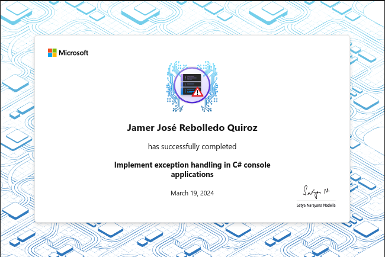

# Implement exception handling in C# console applications

Learn about exceptions, the exception handling process supported by C#, and then
implement exception handling patterns for various coding scenarios.

## Introduction

The C# language includes exception handling features that help you manage
runtime errors that occur due to unexpected or exceptional situations. Exception
handling is implemented in C# using the `try`, `catch`, and `finally` keywords.
These keywords enable your code to try actions that may not succeed, to handle
failures when you decide that it's reasonable to do so, and to clean up
resources afterward. Exceptions can be generated by the common language runtime
(CLR), by .NET or third-party libraries, or by application code.

Suppose you're developing a purchase and inventory management application using
C#. The application processes live purchases and manages the associated
inventory data using a combination of user input and embedded business logic.
Your initial testing shows that irregularities in purchase order data can
produce unexpected error conditions. The errors often result in lost or
mismanaged data. You need to implement exception handling and ensure that your
application performs in an expected manner before it can be released.

In this module, you learn about exceptions, the exception handling process, and
the exception handling patterns supported by C#. You also learn how to implement
exception handling for various coding scenarios. Throughout the module, you'll
complete challenge activities that reinforce what you've learned.

By the end of this module, you'll be able to develop C# applications that manage
unexpected runtime issues and deliver a more stable user experience.

### Learning objectives

In this module, you will

- Examine the basic categories of exceptions and review some common system
  exceptions.
- Examine the exception handling tools included with C# and the techniques for
  these tools.
- Implement the try-catch pattern within various console application scenarios.


## Examine exceptions and exception handling in C#

Runtime errors in a C# application are managed using a mechanism called
exceptions. Exceptions provide a structured, uniform, and type-safe way of
handling both system level and application-level error conditions. Exceptions
are generated by the .NET runtime or by the code in an application. The .NET
runtime provides a set of predefined exceptions that represent common error
conditions. These exceptions are defined in the `System` namespace and are
derived from the `System.Exception` class.

### Common scenarios that require exception handling

There are several programming scenarios that require exception handling. Many of
these scenarios involve some form of data acquisition. Although some of the
scenarios involve coding techniques that are outside the scope of this training,
they're still worth noting.

- Common scenarios that require exception handling include:

- User input: Exceptions can occur when code processes user input. For example,
  exceptions occur when the input value is in the wrong format or out of range.

- Data processing and computations: Exceptions can occur when code performs data
  calculations or conversions. For example, exceptions occur when code attempts
  to divide by zero, cast to an unsupported type, or assign a value that's out
  of range.

- File input/output operations: Exceptions can occur when code reads from or
  writes to a file. For example, exceptions occur when the file doesn't exist,
  the program doesn't have permission to access the file, or the file is in use
  by another process.

- Database operations: Exceptions can occur when code interacts with a database.
  For example, exceptions occur when the database connection is lost, a syntax
  error occurs in a SQL statement, or a constraint violation occurs.

- Network communication: Exceptions can occur when code communicates over a
  network. For example, exceptions occur when the network connection is lost, a
  timeout occurs, or the remote server returns an error.

- Other external resources: Exceptions can occur when code communicates with
  other external resources. Web Services, REST APIs, or third-party libraries,
  can throw exceptions for various reasons. For example, exceptions occur due to
  network connections issues, malformed data, etc.


### Exception handling keywords, code blocks and patterns

Exception handling in C# is implemented by using the try, catch, and finally
keywords. Each of these keywords has an associated code block and can be used to
satisfy a specific goal in your approach to exception handling. For example:

```csharp
try
{
   // try code block - code that may generate an exception
}
catch
{
   // catch code block - code to handle an exception
}
finally
{
   // finally code block - code to clean up resources
}
```

> [!NOTE]
> The C# language also enables your code to generate an exception object by
> using the throw keyword. Exception handling scenarios that include using the
> throw keyword to generate exceptions is covered in a separate module on
> Microsoft Learn.

The `try` code block contains the guarded code that may cause an exception. If
the code within a `try` block causes an exception, the exception is handled by a
corresponding `catch` block.

The `catch` code block contains the code that's executed when an exception is
caught. The `catch` block can handle the exception, log it, or ignore it. A
`catch` block can be configured to execute when any exception type occurs, or
only when a specific type of exception occurs.

The `finally` code block contains code that executes whether an exception occurs
or not. The `finally` block is often used to clean up any resources that are
allocated in a `try` block. For example, ensuring that a variable has the
correct or required value assigned to it.

Exception handling in a C# application is generally implemented using one or
more of the following patterns:

- The `try-catch` pattern consists of a `try` block followed by one or more
`catch` clauses. Each `catch` block is used to specify handlers for different
exceptions.
- The `try-finally` pattern consists of a `try` block followed by a finally
  block. Typically, the statements of a finally block run when control leaves a
  `try` statement.
-  The `try-catch-finally` pattern implements all three types of exception
handling blocks. A common scenario for the `try-catch-finally` pattern is when
resources are obtained and used in a `try` block, exceptional circumstances are
managed in a `catch` block, and the resources are released or otherwise managed
in the finally block.

### How are exceptions represented in code?

Exceptions are represented in code as objects, which means they're an instance
of a class. The .NET class library provides exception classes that're accessed
in code just like other .NET classes. Another example of .NET class that's used
as an object in code is the `Random` class (used to create random numbers).

More precisely, exceptions are types, represented by classes that are all
ultimately derived from `System.Exception`. An exception class that's derived
from `Exception` includes information that identifies the type of exception and
contains properties that provide details about the exception. A more detailed
examination of the `Exception` class is included later in this module.

A runtime instance of a class is generally referred to as an object, so
exceptions are often referred to as exception objects.

> [!NOTE]
> Although they are sometimes used interchangeably, a class and an object are
> different things. A class defines a type of object, but it's not an object
> itself. An object is a concrete entity based on a class.

### Exception handling process

When an exception occurs, the .NET runtime searches for the nearest `catch`
clause that can handle the exception. The process begins with the method that
caused the exception to be thrown. First, the method is examined to see whether
the code that caused the exception is inside a `try` code block. If the code is
inside `try` code block, the `catch` clauses associated with the `try` statement
are considered in order. If the `catch` clauses are unable to handle the
exception, the method that called the current method is searched. This method is
examined to determine whether the method call (to the first method) is inside a
`try` code block. If the call is inside a `try` code block, the associated
`catch` clauses are considered. This search process continues until a `catch`
clause is found that can handle the current exception.

Once a `catch` clause is found that can handle the exception, the runtime
prepares to transfer control to the first statement of the `catch` block.
However, before execution of the `catch` block begins, the runtime executes any
finally blocks associated with `try` statements found during the search. If more
than one finally block is found, they are executed in order, starting with the
one closest to the code that caused the exception to be thrown.

If no `catch` clause is found to handle the exception, the runtime terminates
the application and displays an error message to the user.

Consider the following code sample that includes a `try-finally` pattern nested
inside a `try-catch` pattern:

```csharp
try
{
    // Step 1: code execution begins
    try
    {
        // Step 2: an exception occurs here
    }
    finally
    {
        // Step 4: the system executes the finally code block associated with the try statement where the exception occurred
    }

}
catch // Step 3: the system finds a catch clause that can handle the exception
{
   // Step 5: the system transfers control to the first line of the catch code block
}
```

In this example, the following process occurs:

1. The runtime begins executing the code in the `try` block.
2. An exception occurs in the nested `try` block.
3. The runtime searches for a `catch` clause that can handle the exception.
4. The runtime executes the `finally` block associated with the nested `try`
   statement.
5. The runtime transfers control to the first line of the `catch` block.

In this simple example, the nested `try-catch` and `try-finally` patterns reside
within a single method, but multiple `try-catch` and `try-finally` patterns
could be spread between methods that call other methods.

### Exception handling and the call stack

You'll often see the term "call stack unwinding" when you read about exception
handling and the exception handling process. To understand this term, you need
to understand the call stack and how it's used to track the "stack" of method
calls during code execution.

You can think of the call stack like a tower of blocks. When you build a tower,
you start with just one block. Each time you add a block to the tower, you place
it on top of the existing blocks. When your application starts running in the
debugger, the entry point to your application is the first layer added to the
call stack (the first block of the tower). Each time a method calls another
method, the new method is added to the top of the stack. When your code exits
out of a method, the method is removed from the call stack.

> [!NOTE]
> For a console application, the entry point to your application is the
> top-level statements. In the Visual Studio Code call stack, this entry point
> is referred to as the Main method.

Call stack unwinding is the process that the .NET runtime uses when a C# program
encounters an error. It's the same process that you just reviewed.

Returning to the block tower analogy, when you need to remove a block from the
tower, you start from the top and remove each block until you reach the one you
need. This process is similar to how call stack unwinding works, where each call
layer in the stack is like a block in the tower. When the runtime needs to
unwind the call stack, it starts from the top and removes each call layer until
it reaches the one that has what it needs. In this case, the call layer that it
needs is the method that has a catch clause that can handle the exception that
occurred.

### Recap

Here's a recap of the key points covered in this unit:

- Common scenarios that may require exception handling include user input, data processing, file I/O operations, database operations, and network communication.
- Exception handling in C# is implemented using try, catch, and finally keywords. Each keyword has an associated code block that serves a specific purpose.
- Exceptions are represented as types and derived from the System.Exception class in .NET. Exceptions contain information that identifies the type of exception, and properties that provide additional details.
- When an exception occurs, the .NET runtime searches for the nearest catch clause that can handle it. The search starts with the method where the exception was thrown, and moves down the call stack if necessary.


## Examine compiler-generated exceptions

Exceptions are generated by the .NET runtime or by code in a program. The exception type is dependent on the code that causes the exception.

### Compiler-generated exceptions

The .NET runtime throws exceptions when basic operations fail. Here's a short list of runtime exceptions and their error conditions:

- `ArrayTypeMismatchException`: Thrown when an array can't store a given element because the actual type of the element is incompatible with the actual type of the array.
- `DivideByZeroException`: Thrown when an attempt is made to divide an integral value by zero.
- `FormatException`: Thrown when the format of an argument is invalid.
- `IndexOutOfRangeException`: Thrown when an attempt is made to index an array when the index is less than zero or outside the bounds of the array.
- `InvalidCastException`: Thrown when an explicit conversion from a base type to an interface or to a derived type fails at runtime.
- `NullReferenceException`: Thrown when an attempt is made to reference an object whose value is null.
- `OverflowException`: Thrown when an arithmetic operation in a checked context overflows.

### Code samples for compiler-generated exceptions

The following code samples show an example of the code that causes a compiler-generated exception.

#### ArrayTypeMismatchException

An exception of type `ArrayTypeMismatchException` is thrown when an attempt is
made to store an element of the wrong type within an array. The following
example throws an `ArrayTypeMismatchException` exception when trying to store a
numeric value in a string array.

```csharp
string[] names = { "Dog", "Cat", "Fish" };
Object[] objs = (Object[])names;

Object obj = (Object)13;
objs[2] = obj; // ArrayTypeMismatchException occurs
```

#### DivideByZeroException

An exception of type `DivideByZeroException` occurs when trying to divide an
integer or Decimal number by zero. The following example throws a
`DivideByZeroException` exception when performing integer division.

```csharp
int number1 = 3000;
int number2 = 0;
Console.WriteLine(number1 / number2); // DivideByZeroException occurs
```

> [!NOTE]
> Dividing a floating-point value by zero doesn't throw an exception; it results
> in positive infinity, negative infinity, or not a number (NaN), according to
> the rules of IEEE 754 arithmetic.

#### FormatException

An exception of type `FormatException` occurs when the format of an argument is
invalid, or when a composite format s tring is not well formed. The following
example throws a `FormatException` exception when trying to convert a string to
an integer.

```csharp
int valueEntered;
string userValue = "two";
valueEntered = int.Parse(userValue); // FormatException occurs
```

#### IndexOutOfRangeException

An exception of type `IndexOutOfRangeException` is thrown when an attempt is
made to access an element of an array or collection with an index that is
outside its bounds. The following example throws an `IndexOutOfRangeException`
exception when attempting to assign the last element of the `values1` array to
the last element of the `values2` array.

```csharp
int[] values1 = { 3, 6, 9, 12, 15, 18, 21 };
int[] values2 = new int[6];

values2[values1.Length - 1] = values1[values1.Length - 1]; // IndexOutOfRangeException occurs
```

#### InvalidCastException

An exception of type `InvalidCastException` is thrown when attempting an invalid
casting or explicit conversion. The following example throws an
`InvalidCastException` when attempting to cast an `object` of type string to an
`int` variable.

```csharp
object obj = "This is a string";
int num = (int)obj;
```

#### NullReferenceException

An exception of type `NullReferenceException` is thrown when attempting to
access a member on a type whose value is null. Two examples are shown. In the
first example, a `NullReferenceException` is thrown when attempting to access an
element of a null array. The second example throws a `NullReferenceException`
when attempting to access a method of a null string.

```csharp
int[] values = null;
for (int i = 0; i <= 9; i++)
    values[i] = i * 2;

string? lowCaseString = null;
Console.WriteLine(lowCaseString.ToUpper());
```

#### OverflowException

An exception of type `OverflowException` occurs when an arithmetic operation
attempts to assign a result that's outside the range of the target data type.
The following example throws an `OverflowException` exception when attempting to
convert a `decimal` value of 400 to a `byte` variable.

```csharp
decimal x = 400;
byte i;

i = (byte)x; // OverflowException occurs
Console.WriteLine(i);
```

### Recap

Here's a recap of the key points covered in this unit:

- The .NET runtime throws an exception when an operation fails.
- The exception type is dependent on the code that causes the exception.
- Your application should catch runtime exceptions.


## Exercise 1 - Implement try-catch exception handling

The `try-catch` pattern consists of a `try` block followed by one or more
`catch` clauses. Each `catch` clause specifies the handler for a different
exception type.

When an exception is thrown, the common language runtime (CLR) searches for a
`catch` clause that can handle the exception. If the currently executing method
doesn't contain a `catch` clause that can handle the exception type thrown, the
CLR searches the method that called the current method. The search continues
down through the call stack until a suitable `catch` clause is found. If no
`catch` clause is found to handle the exception, the CLR displays an unhandled
exception message to the user and stops the execution of the program.

In this exercise, you'll implement a basic `try-catch` pattern.

### Code

[C#](./Exercises/Exercise1/Program.cs)

### Recap

Here's a recap of the key points covered in this unit:

- Implement a try-catch pattern to try specified code lines within your
  application and catch exceptions that occur within the scope of the try code
  block.
- Use a catch clause to catch an exception thrown at the same level of the call
  stack.
- Use a catch clause to catch an exception thrown at a higher level of the ca

## Exercise 2 - Complete a challenge activity for try-catch

Code challenges in this module are used to reinforce what you've learned and
help you gain some confidence before continuing on.

### Code

[C#](./Exercises/Exercise2/Program.cs)

### Review

The following code is a possible solution to the challenge:

```csharp
try
{
    Process1();
}
catch
{
    Console.WriteLine("An exception has occurred");
}

Console.WriteLine("Exit program");

static void Process1()
{
    try
    {
        WriteMessage();
    }
    catch
    {
        Console.WriteLine("Exception caught in Process1");
    }

}

static void WriteMessage()
{
    double float1 = 3000.0;
    double float2 = 0.0;
    int number1 = 3000;
    int number2 = 0;

    Console.WriteLine(float1 / float2);
    Console.WriteLine(number1 / number2);
}
```

In this solution, the `Process1` method has been updated to use the `try-catch`
pattern. The WriteMessage method is called in the `try` code block, which
enables `Process1` to catch the exception before it's caught by the `catch`
clause in the top-level statements.

Running this application generates the required output:

```plaintext
∞
Exception caught in Process1
Exit program
```

Notice that since the exception is caught inside Process1, the catch code block
in the top-level statements is not executed. The benefits gained by catching
exceptions at different levels in the call stack becomes more evident when
specific exception types are being caught. You'll examine exception types in the
next unit.

## Exercise 3 - Catch specific exception types

Earlier in this module, you learned that the exception objects caught by your C#
application are instances of an exception class. Generally speaking, your code
will `catch` one of the following:

An exception object that's an instance of the `System.Exception` base class. An
exception object that's an instance of an exception type that inherits from the
base class. For example, an instance of the `InvalidCastException` class.

### Examine exception properties

System.Exception is the base class that all derived exception types inherit
from. Each exception type inherits from the base class through a specific class
hierarchy. For example, the class hierarchy for the InvalidCastException is as
follows

```plaintext
Object
    Exception
        SystemException
            InvalidCastException
```

Most of the exception classes that inherit from `Exception` don't add any
additional functionality; they simply inherit from `Exception`. Therefore,
examining the properties of the `Exception` class enables you to understand most
exceptions, and how you might use an exception in your code.

Here are the properties of the Exception class:

- **Data**: The Data property holds arbitrary data in key-value pairs.
- **HelpLink**: The HelpLink property can be used to hold a URL (or URN) to a
  help file that provides extensive information about the cause of an exception.
- **HResult**: The HResult property can be used to access to a coded numerical
  value that's assigned to a specific exception.
- **InnerException**: The InnerException property can be used to create and
  preserve a series of exceptions during exception handling.
- **Message**: The Message property provides details about the cause of an
  exception.
- **Source**: The Source property can be used to access the name of the
  application or the object that causes the error.
- **StackTrace**: The StackTrace property contains a stack trace that can be
  used to determine where an error occurred.
- **TargetSite**: The TargetSite property can be used to get the method that
  throws the current exception.


### Code

[C#](./Exercises/Exercise3/Program.cs)

### Recap

- The catch clause should be configured to catch a specific exception type. For
  example, the DivideByZeroException exception type.
- The properties of an exception object can be accessed within the catch block.
  For example, you can use the Message property to inform the application user
  of an issue.
- You can specify two or more catch clauses when you need to catch more than one
  exception type.

## Exercise 4 - Complete a challenge activity to catch specific exceptions

Code challenges in this module are used to reinforce what you've learned and
help you gain some confidence before continuing on.

### Catch specific exceptions challenge

In this challenge, you're provided with a code sample that generates several different exception types. A single try code block contains the code that generates the exceptions. Multiple catch clauses are included to handle specific exception types.

You need to update the code sample so that each exception is caught and the corresponding error message is displayed to the console.

Here are the requirements for this challenge:

1. Ensure that the code sample catches the following exception types:
```cs
try
{
    int num1 = int.MaxValue;
    int num2 = int.MaxValue;
    int result = num1 + num2;
    Console.WriteLine("Result: " + result);

    string str = null;
    int length = str.Length;
    Console.WriteLine("String Length: " + length);

    int[] numbers = new int[5];
    numbers[5] = 10;
    Console.WriteLine("Number at index 5: " + numbers[5]);

    int num3 = 10;
    int num4 = 0;
    int result2 = num3 / num4;
    Console.WriteLine("Result: " + result2);
}
catch (OverflowException ex)
{
    Console.WriteLine("Error: The number is too large to be represented as an integer." + ex.Message);
}
catch (NullReferenceException ex)
{
    Console.WriteLine("Error: The reference is null." + ex.Message);
}
catch (IndexOutOfRangeException ex)
{
    Console.WriteLine("Error: Index out of range." + ex.Message);
}
catch (DivideByZeroException ex)
{
    Console.WriteLine("Error: Cannot divide by zero." + ex.Message);
}

Console.WriteLine("Exiting program.");
```

2. Update the code sample to catch the specific exception types that are thrown.

3. In each catch clause, display the error message to the console.


### Code

[C#](./Exercises/Exercise4/Program.cs)


## Summary

Your goal was to gain experience implementing exception handling in C# applications using Visual Studio Code.

By examining the properties of common exception types and experimenting with the try-catch pattern, you gained experience catching runtime exceptions. You used exception handling to catch exceptions in the method where they occurred and at a lower level of the call stack. You also practiced using two or more catch clauses to catch different exception types associated with a single try code block.

Without the ability to implement exception handling, you wouldn't be able to delivery stable and reliable C# applications.

### Reference Materials

- You can find additional information about exception properties here: https://learn.microsoft.com/dotnet/standard/exceptions/exception-class-and-properties and https://learn.microsoft.com/dotnet/api/system.exception.

- You can find additional information about exceptions here: https://learn.microsoft.com/dotnet/csharp/language-reference/language-specification/exceptions.

- You can find additional information about using specific exception types here: https://learn.microsoft.com/dotnet/standard/exceptions/how-to-use-specific-exceptions-in-a-catch-block.

- You can find additional information about the try-catch-finally patterns here: https://learn.microsoft.com/dotnet/csharp/language-reference/keywords/try-catch-finally.


## Achievement


