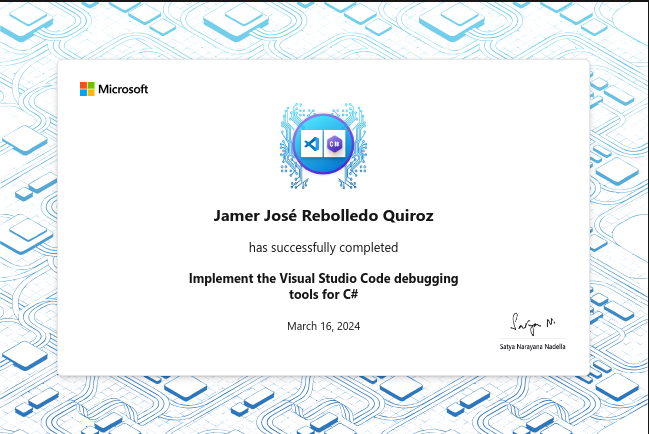

# Implement the Visual Studio Code debugging tools for C#

Learn how to effectively debug C# programs in Visual Studio Code using
breakpoints and the other debugging tools, such as resources in the RUN AND
DEBUG view.

## Introduction

The faster you discover and identify bugs, the faster you can get your code
stabilized and released. Visual Studio Code supports code debugging for C# and
most other software development languages through the use of Extensions. Once
you've learned to use Visual Studio Code's debug tools, you'll spend less time
wondering why your code stopped working and more time developing great
applications.

Suppose you're using Visual Studio Code to develop a C# console application. The
primary purpose of the application is to process customer data based on business
rules. You develop the application using a small sample data set and it runs
without errors. However, when you run the code using the larger data set, your
code produces some unexpected results. You've read through the code several
times but it's difficult to find the errors in your logic. You've heard that
Visual Studio Code has good debugger tools, but you've never had to use them.
You can't waste any more time reading through the code. You decide that learning
the debugger tools is your best chance for completing the project on time.

In this module, you learn how to effectively debug C# programs in Visual Studio
Code using breakpoints and other debugging tools, such as resources in the RUN
AND DEBUG view.

By the end of this module, you'll be able to configure and use the Visual Studio
Code debugger tools for C#.

### Learning objectives

In this module, you will

- Configure the Visual Studio Code debugger for a C# program.
- Create breakpoints and step through your code to isolate issues.
- Inspect your program state at any execution step.
- Use the call stack to find the source of an exception.

Ultimately, you'll be able to isolate code bugs efficiently using the debugger
tools, and you won't need to rely on `Console.WriteLine` anymore.

## Examine the Visual Studio Code debugger interface

The Visual Studio Code user interface provides several ways to configure debug
options and launch debug sessions.

### Debug features in the Visual Studio Code user interface

Visual Studio Code includes several user interface features that will help you
to configure, start, and manage debug sessions:

- Configure and launch the debugger: The Run menu and RUN AND DEBUG view can
  both be used to configure and launch debug sessions.
- Examine application state: The RUN AND DEBUG view includes a robust interface
  that exposes various aspects of your application state during a debug session.
- Runtime execution control: The Debug toolbar provides high-level runtime
  controls during code execution.

### Run and Debug view user interface

The RUN AND DEBUG view provides access to runtime tools that can be invaluable
during the debug process.


1. Run and Debug controls panel. Used to configure and start a debug session.

2. VARIABLES section. Used to view and manage variable state during a debug
   session.

3. WATCH section. Used to monitor variables or expressions. For example, you
   could configure an expression using one or more variables and watch it to see
   when a particular condition is met.

4. CALL STACK section. Used to keep track of the current point of execution
   within the running application, starting with the initial point of entry into
   the application. The call stack shows which method is currently being
   executed, as well as the method or methods in the execution path that led to
   the current point of execution (current line of code).

5. BREAKPOINTS section. Displays the current breakpoint settings.

6. Debug toolbar. Used to control code execution during the debug process. This
   toolbar is only displayed while the application is running.

7. Current execution step. Used to identify the current execution step by
   highlighting it in the Editor. In this case, the current execution step is a
   breakpoint (breakpoints are marked with a red dot to the left of the line
   number).

8. DEBUG CONSOLE. Used to display messages from the debugger. The DEBUG CONSOLE
   panel is the default console for console applications and is able to display
   output from Console.WriteLine() and related Console output methods.

### Controls panel for the Run and Debug view

At the top of the RUN AND DEBUG view, you can find the launch controls:


## Exercise 1 - Run code in the debug environment

The Visual Studio Code user interface enables developers to run their code in a
debug environment. Support for debugging is provided by extensions, and for C#
developers, debugger support is provided by the same extension that provides
support for code development and IntelliSense.

### Debugger and application interaction

A code debugger can be used to pause and resume code execution, examine variable
state, and even change the values assigned to variables at runtime. You may be
wondering, how can the debugger control and modify a running application? The
short answer is, the debugger has access to the application's runtime
environment and executable code.

The Visual Studio Code debugger for C# uses the .NET Core runtime to launch and
interact with an application. When you start the debugger, it creates a new
instance of the runtime and runs the application within that instance. The
runtime includes an application programming interface (API), which the debugger
uses to attach to the running process (your application).

Once your application is running and the debugger is attached, the debugger
communicates with the running process using the .NET Core runtime's debugging
APIs and a standard debug protocol. The debugger can interact with the process
(the application running within the .NET runtime instance) by setting
breakpoints, stepping through code, and inspecting variables. Visual Studio
Code's debugger interface enables you to navigate the source code, view call
stacks, and evaluate expressions.

The most common way to specify a debug session is a launch configuration in the
launch.json file. This approach is the default option enabled by the debugger
tools. For example, if you create a C# console application and select Start
Debugging from the Run menu, the debugger uses this approach to launch, attach
to, and then interact with your application.

### Recap

Here are a few important things to remember from this unit:

- The Visual Studio Code debugger for C# uses the .NET Core runtime to launch
  and interact with an application.
- The Visual Studio Code Run menu has options to start an application with and
  without the debugger attached.
- The Debug toolbar includes a button to Stop a running process.
- The RUN AND DEBUG view includes an option to start debugging an application.

## Examine breakpoint configuration options

Debuggers are used to help you to analyze your code and can be used to control
your program's runtime execution. When you start the Visual Studio Code
debugger, it immediately begins executing your code. Because your code executes
in micro-seconds, effective code debugging depends on your ability to pause the
program on any statement within your code. Breakpoints are used to specify where
code execution pauses.

### Set breakpoints

Visual Studio Code provides several ways to configure breakpoints in your code.
For example:

- Code Editor: You can set a breakpoint in the Visual Studio Code Editor by
  clicking in the column to the left of a line number.

- Run menu: You can toggle a breakpoint on/off from the Run Menu. The current
  line in the Editor specifies where the Toggle Breakpoint action is applied.

When a breakpoint is set, a red circle is displayed to the left of the line
number in the Editor. When you run your code in the debugger, execution pauses
at the breakpoint.


### Remove, disable, and enable breakpoints

After setting breakpoints in your application and using them to isolate an
issue, you may want to remove or disable the breakpoints.

To remove a breakpoint, repeat the action used to set a breakpoint. For example,
click the red circle to the left of the line number or use the toggle breakpoint
option on the Run menu.

What if you want to keep a breakpoint location, but you don't want it to trigger
during your next debug session? Visual Studio Code enables you to "disable" a
breakpoint rather than removing it altogether. To disable an active breakpoint,
right-click the red dot to the left of the line number, and then select Disable
Breakpoint from the context menu.


When you disable a breakpoint, the red dot to the left of the line number is
changed to a grey dot.

> [!NOTE]
> The context menu that appears when you right-click a breakpoint also
> includes the options to Remove Breakpoint (Delete) and Edit Breakpoint. The
> Edit Breakpoint option is examined in the Conditional breakpoints and
> Logpoints section later in this unit.

In addition to managing individual breakpoints in the Editor, the Run menu
provides options for performing bulk operations that act on all breakpoints:

- Enable All Breakpoints: Use this option to enable all disabled breakpoints.
- Disable All Breakpoints: Use this option to disable all breakpoints.
- Remove All Breakpoints: Use this option to remove all breakpoints (both
  enabled and disabled breakpoints are removed).

### Conditional breakpoints

A conditional breakpoint is a special type of breakpoint that only triggers when
a specified condition is met. For example, you can create a conditional
breakpoint that pauses execution when a variable named `numItems` is greater
than 5.

You've already seen that right-clicking a breakpoint opens a context menu that
includes the Edit Breakpoint option. Selecting Edit Breakpoint enables you to
change a standard breakpoint into a conditional breakpoint.


In addition to editing an existing breakpoint, you can also set a conditional
breakpoint directly. If you right-click (rather than left-click) to set a new
breakpoint, you can choose to create a conditional breakpoint.


When you create a conditional breakpoint, you need to specify an expression that
represents the condition.

Each time the debugger encounters the conditional breakpoint, it evaluates the
expression. If the expression evaluates as `true`, the breakpoint is triggered
and execution pauses. If the expression evaluates as `false`, execution
continues as if there was no breakpoint.

For example, suppose you need to debug some code that's inside the code block of
a `for` loop. You've noticed that the issue you're debugging only occurs after
the loop has completed several iterations. You decide that you want the
breakpoint to trigger once the loop's iteration control variable, `i`, is
greater than three. You create a conditional breakpoint and specify the
expression `i > 3`.


When you run your code in the debugger, it skips over your breakpoint until the
iteration when `i > 3` evaluates as true. When `i = 4`, execution pauses on your
conditional breakpoint.

### Support for `Hit Count` breakpoints and `Logpoints`

The C# debugger for Visual Studio Code also supports `Hit Count` breakpoints and `Logpoints`.

A 'hit count' breakpoint can be used to specify the number of times that a breakpoint must be encountered before it will 'break' execution. You can specify a hit count value when creating a new breakpoint (with the Add Conditional Breakpoint action) or when modifying an existing one (with the Edit Condition action). In both cases, an inline text box with a dropdown menu opens where you can enter the hit count value.

A 'Logpoint' is a variant of a breakpoint that does not "break" into the debugger but instead logs a message to the console. Logpoints are especially useful for injecting logging while debugging production environments that cannot be paused or stopped. A Logpoint is represented by a "diamond" shaped icon rather than a filled circle. Log messages are plain text but can include expressions to be evaluated within curly braces ('{}').

Logpoints can include a conditional 'expression' and/or 'hit count' to further control when logging messages are generated. For example, you can combine a Logpoint message of `i = {i}` with Hit Count condition `>4` to generate log messages as follows:


### Recap

Here's a few important things to remember from this unit:

- Visual Studio Code enables setting breakpoints in the code editor or from the
  Run menu. Breakpoint code lines are marked with a red dot to the left of the
  line number.
- Breakpoints can be removed or disabled using the same options used to set
  them. Bulk operations that affect all breakpoints are available on the Run
  menu.
- Conditional breakpoints can be used to pause execution when a specified
  condition is met or when a 'hit count' is reached.
- Logpoints can be used to log information to the terminal without pausing
  execution or inserting code.

## Exercise 2 - Set breakpoints

Breakpoints are used during the debug process pause execution. This enables you
to track variables and examine the sequence in which your code is executed.
Breakpoints are a great way to start your debug process.

### Set a breakpoint

Earlier in this module you completed an exercise where you ran an application in
the debugger. The application displayed "greeting messages" in the DEBUG CONSOLE
panel. At the end of the exercise, you noticed that the code repeats Andrew's
greeting in an unexpected way.

In this exercise, you'll use a breakpoint to help you identify the issue.

### Recap

Here's a few important things to remember from this unit

- Use breakpoints to pause code execution during a debug session.
- Use Step Into from the Debug controls toolbar to observe the next executable
  code line.
- Use Step Out from the Debug controls toolbar to advance through the current
  method and back to the code line that called the method.

## Examine the launch configurations file

You've already seen that Visual Studio Code uses the launch.json file to
configure the debugger. If you're creating a simple C# console application, it's
likely that Visual Studio Code generates a launch.json file that has all of the
information you need to successfully debug your code. However, there are cases
when you need to modify a launch configuration, so it's important to understand
the attributes of a launch configuration.

### Attributes of a launch configuration

The launch.json file includes one or more launch `configurations` in the
configurations list. The launch configurations use attributes to support
different debugging scenarios. The following attributes are mandatory for every
launch configuration:

- `name`: The reader-friendly name assigned to the launch configuration.
- `type`: The type of debugger to use for the launch configuration.
- `request`: The request type of the launch configuration.


This section defines some of the attributes you may encounter.

#### Name

The `name` attribute specifies the display name for the launch configuration.
The value assigned to `name` appears in the launch configurations dropdown (on
the controls panel at the top of the RUN AND DEBUG view).

#### Type

The `type` attribute specifies the type of debugger to use for the launch
configuration. A value of `codeclr` specifies the debugger type for .NET 5+ and
.NET Core applications (including C# applications).

#### Request

The `request` attribute specifies the request type for the launch configuration.
Currently, the values `launch` and `attach` are supported.

#### PreLaunchTask

The `preLaunchTask` attribute specifies a task to run before debugging your
program. The task itself can be found in the tasks.json file, which is in the
`.vscode` folder along with the launch.json file. Specifying a prelaunch task of
`build` runs a `dotnet build` command before launching the application.

#### Program

The `program` attribute is set to the path of the application dll or .NET Core
host executable to launch.

This property normally takes the form:
`${workspaceFolder}/bin/Debug/<target-framework>/<project-name.dll>`.

Where:

- `<target-framework>` is the framework that the debug project is being built
  for. This value is normally found in the project file as the 'TargetFramework'
  property.
- `<project-name.dll>` is the name of debugged project's build output dll. This
  property is normally the same as the project file name but with a '.dll'
  extension.

For example: `${workspaceFolder}/bin/Debug/net7.0/Debug101.dll`

> [!NOTE]
> The .dll extension indicates that this file is a dynamic link library (dll)
> file. If your project is named Debug101, a file named Debug101.dll is created
> when a build task compiles your program using the Program.cs and
> Debug101.csproj files. You can find the Debug101.dll file in the EXPLORER view
> by expanding the "bin" and "Debug" folders, and then opening a folder that
> represents the .NET framework used by your code project, such as "net7.0". The
> .NET Framework version is specified in your .csproj file.

#### Cwd

The `cwd` attribute specifies the working directory of the target process.

#### Args

The `args` attribute specifies the arguments that are passed to your program at launch. There are no arguments by default.

#### Console

The `console` attribute specifies the type of console that's used when the application is launched. The options are `internalConsole`, `integratedTerminal`, and `externalTerminal`. The default setting is `internalConsole`. The console types are defined as:

The `internalConsole` setting corresponds to the DEBUG CONSOLE panel in the Panels area below the Visual Studio Code Editor.
The `integratedTerminal` setting corresponds to the OUTPUT panel in the Panels area below the Visual Studio Code Editor.
The `externalTerminal` setting corresponds to an external terminal window. The Command Prompt application that comes with Windows is an example of a terminal window.

> [!IMPORTANT]
> The DEBUG CONSOLE panel doesn't support console input. For example, the DEBUG
> CONSOLE can't be used if the application includes a Console.ReadLine()
> statement. When you're working on a C# console application that reads user
> input, the console setting must be set to either integratedTerminal or
> externalTerminal. Console applications that write to the console, but don't
> read input from the console, can use any of the three console settings.

#### Stop at Entry

If you need to stop at the entry point of the target, you can optionally set
`stopAtEntry` to be `true`.

### Edit a launch configuration

There are lots of scenarios when you might need to customize the launch
configuration file. Many of those scenarios involve advanced or complex project
scenarios. This module focuses on two simple scenarios when updating the launch
configuration file is required:

- Your C# console application reads input from the console.
- Your project workspace includes more than one application.

### Update the launch configuration to accommodate console input

As you read earlier, the DEBUG CONSOLE panel doesn't support console input. If
you're debugging a console application that relies on user input, you need to
update the `console` attribute in the associated launch configuration.

To edit the `console` attribute:

1. Open the launch.json file in the Visual Studio Code Editor.

2. Locate the console attribute.

3. Select the colon and assigned value, and then enter a colon character.

4. Notice that when you overwrite the existing information with a colon, Visual
   Studio Code IntelliSense displays the three options in a dropdown list.


5. Select either integratedTerminal or externalTerminal.

6. Save the launch.json file.

### Update the launch configuration to accommodate multiple applications

If your workspace has only one launchable project, the C# extension will
automatically generate the launch.json file. If you have more than one
launchable project, then you need to modify your launch.json file manually.
Visual Studio Code generates a launch.json file using the basic template that
you can update. In this scenario, you create separate configurations for each
application that you want to debug. Prelaunch tasks, such as a build task, can
be created in the tasks.json file.

Suppose that you're working on a coding project that includes several console
applications. The root project folder, SpecialProjects, is the workspace folder
that you open in Visual Studio Code when you work on your code. You have two
applications that you're developing, Project123 and Project456. You use the RUN
AND DEBUG view to debug the applications. You want to select the application
that you're debugging from the user interface. You also want any saved code
updates to be compiled prior to attaching the debugger to your application.

You can achieve the requirements for this scenario by updating the launch.json
and tasks.json files.

The following screenshot shows the EXPLORER view and the folder structure
containing Project123 and Project456.


Notice that the `.vscode` folder containing the launch.json and tasks.json files
is associated with the workspace folder, SpecialProjects, not the individual
project folders.

The following example shows how you could configure the launch.json file to
include configurations for both the "Project123" and "Project456" applications.

`launch.json`
```json
"version": "0.2.0",
"configurations": [
    {
        "name": "Launch Project123",
        "type": "coreclr",
        "request": "launch",
        "preLaunchTask": "buildProject123",
        "program": "${workspaceFolder}/Project123/bin/Debug/net7.0/Project123.dll",
        "args": [],
        "cwd": "${workspaceFolder}/Project123",
        "console": "internalConsole",
        "stopAtEntry": false
    },
    {
        "name": "Launch Project456",
        "type": "coreclr",
        "request": "launch",
        "preLaunchTask": "buildProject456",
        "program": "${workspaceFolder}/Project456/bin/Debug/net7.0/Project456.dll",
        "args": [],
        "cwd": "${workspaceFolder}/Project456",
        "console": "internalConsole",
        "stopAtEntry": false
    }
]
```

Notice that the name, preLaunchTask, and program fields are all configured for a
specific application.

The name attribute specifies the selectable launch option that's displayed in
the RUN AND DEBUG view user interface, the program attribute specifies the path
to your application. The preLaunchTask attribute is used to specify the name of
the task that's performed prior to launching the debugger. The tasks.json file
contains the named tasks and the information required to complete the task.

The following example shows how you could configure the tasks.json file. In this
case, the named tasks specify build operations that are specific to the
"Project123" and "Project456" applications. The build task ensures that any
saved edits are compiled and represented in the corresponding .dll file that's
attached to the debugger.

`tasks.json`
```json
"version": "2.0.0",
"tasks": [
    {
        "label": "buildProject123",
        "command": "dotnet",
        "type": "process",
        "args": [
            "build",
            "${workspaceFolder}/Project123/Project123.csproj",
            "/property:GenerateFullPaths=true",
            "/consoleloggerparameters:NoSummary"
        ],
        "problemMatcher": "$msCompile"
    },
    {
        "label": "buildProject456",
        "command": "dotnet",
        "type": "process",
        "args": [
            "build",
            "${workspaceFolder}/Project456/Project456.csproj",
            "/property:GenerateFullPaths=true",
            "/consoleloggerparameters:NoSummary"
        ],
        "problemMatcher": "$msCompile"
    }
]
```

With your updates to the launch.json and tasks.json files in place, the RUN AND
DEBUG view displays launch options for debugging either the Project123 or
Project456 application. The following screenshot shows the names of the launch
configurations displayed in the launch configuration dropdown:


### Recap

- Launch configurations are used to specify attributes such as name, type,
  request, preLaunchTask, program, and console.
- Developers can edit a launch configuration to accommodate project
  requirements.

## Configure conditional breakpoints in C#

The C# debugger for Visual Studio Code supports the option to configure a
breakpoint that only triggers if a condition is met. This type of breakpoint is
called a conditional breakpoint. Conditional breakpoints can be configured
directly or by editing an existing breakpoint.

> [!NOTE]
> Visual Studio Code also supports a conditional breakpoint that triggers based
> on the number of times the breakpoint has been "hit".

Suppose you're debugging an application that processes product information in a multidimensional string array. The array includes thousands of data points. The problem that you're debugging seems to occur for products that are marked as `new`. Your code processes the array inside a `for` loop. You need to set a breakpoint inside the loop, but you only want to pause when products are `new`.

### Use a standard breakpoint to examine a data processing application

### Recap

Here are two important things to remember from this unit

- Use a standard breakpoint to pause an application each time a breakpoint is encountered.
- Use a conditional breakpoint to pause an application when a Boolean expression evaluates to true.

## Exercise 3 - Monitor variables and execution flow

The RUN AND DEBUG view provides developers with an easy way to monitor variables and expressions, observe execution flow, and manage breakpoints during the debug process.

### Examine the sections of the Run and Debug view

Each section of the RUN AND DEBUG view provides unique capabilities. Using a combination of these sections during the debug process is often helpful.

#### VARIABLES section

Monitoring variable state is an important aspect of code debugging. Unexpected changes in variable state will often help to identify logic errors in your code.

The VARIABLES section organizes your variables by scope. The `Locals` scope displays the variables in the current scope (the current method).

> [!NOTE]
> The top-level statements section of a console application is considered its
> own method. A method named Main.

You can unfold (expand) the displayed scopes by selecting the arrow to the left
of the scope name. You can also unfold variables and objects. The following
screenshot shows the `numbers` array unfolded under the `Locals` scope.


It's also possible to change the value of a variable at runtime using the
VARIABLES section. You can double-click the variable name and then enter a new
value.

#### WATCH section

What if you want to track a variable state across time or different methods? It
can be tedious to search for the variable every time. That's where the WATCH
section comes in handy.

You can select the Add Expression button (appears as a plus sign: +) to enter a
variable name or an expression to watch. As an alternative, you can right-click
a variable in the VARIABLES section and select `Add to watch`.

All expressions inside the WATCH section will be updated automatically as your
code runs.

#### CALL STACK section

Every time your code enters a method from another method, a call layer is added to the application's call stack. When your application becomes complex and you have a long list of methods called by other methods, the call stack represents the trail of method calls.

The CALL STACK section is useful when you're trying to find the source location for an exception or WATCH expression. If your application throws an unexpected exception, you'll often see a message in the console that resembles the following:

```
Exception has occurred: CLR/System.DivideByZeroException
An unhandled exception of type 'System.DivideByZeroException' occurred in Debug1.dll: 'Attempted to divide by zero.'
    at Program.<<Main>$>g__WriteMessage|0_1() in C:\Users\howdc\Desktop\Debug1\Program.cs:line 27
    at Program.<<Main>$>g__Process1|0_0() in C:\Users\howdc\Desktop\Debug1\Program.cs:line 16
    at Program.<Main>$(String[] args) in C:\Users\howdc\Desktop\Debug1\Program.cs:line 10
```

The indented group of `at Program ...` lines under the error message is called a stack trace. The stack trace lists the name and origin of every method that was called leading up to the exception. The information can be a bit difficult to decipher though, because it can also include information from the .NET runtime. In this example, the stack trace is pretty clean and you can see that exception occurred in a method named `WriteMessage`. The stack originates in a method named `Main`, which is the top-level statements section of the console application.

The CALL STACK section can help you to avoid the difficulty of deciphering a stack trace that's cluttered with .NET runtime information. It filters out unwanted information to show you only the relevant methods from your own code by default. You can manually unwind the call stack to find out where the exception originated.

#### BREAKPOINTS section

The BREAKPOINTS section displays the current breakpoint settings and can be used to enable or disable specific breakpoints during a debug session.

### Configure your application and launch configuration

#### Monitor watch expressions

The WATCH section can be used to monitor expressions that are based on one or more variables.

Suppose you're working on an application that performs numeric calculations on a data set. You believe that your code produces unreliable results when the ratio between two numeric variables is greater than 5. You can use the WATCH section to monitor the calculated ratio.

### Recap

Here are a few important things to remember:

- Monitor variable state using the VARIABLES section of the RUN AND DEBUG view.
- Track an expression across time or different methods using the WATCH section of the RUN AND DEBUG view.
- Use the CALL STACK section of the RUN AND DEBUG view to find the source location of an exception or a WATCH expression.
- Use the VARIABLES section to change a variable's assigned value at runtime.

## Exercise 4 - Complete a challenge activity using the debugger

Code challenges in this training are used to reinforce what you've learned and help you gain some confidence before continuing on.

### Variable state challenge

In this challenge, you're provided with a code sample that isn't producing the expected result. You need to use breakpoints and the VARIABLES section of the RUN AND DEBUG view to help you figure out the issues.

### Code

[C#](./Exercises/Exercise1/Program.cs)

## Summary

Your goal was to gain experience debugging C# applications with Visual Studio Code.

By configuring the Visual Studio Code debugger environment for different sample application scenarios, you gained experience with nearly every aspect of the debugger interface. You used breakpoints and conditional breakpoints to pause execution at critical locations within your code. While execution was paused, you used the VARIABLES, WATCH, and CALL STACK sections of the RUN AND DEBUG view to evaluate the state of variables, expressions, and the overall application. You also used the execution controls on the Debug toolbar step through and over code lines while your application is running. You even used the launch.json file to configure which console to use and to configure the debug environment for projects that include more than one executable.

Without the ability to configure and use the Visual Studio Code debugger tools, you wouldn't be able to isolate and fix code bugs in a timely manner.

### Reference materials

- You can find additional information about the Visual Studio Code debugger and launch configurations here: https://code.visualstudio.com/docs/editor/debugging.

- You can find additional information about .NET debugging in Visual Studio Code here: https://github.com/OmniSharp/omnisharp-vscode/blob/master/debugger.md.

- You can find additional information about configuring the C# debugger here: https://code.visualstudio.com/docs/csharp/debugger-settings.

## Achievement


