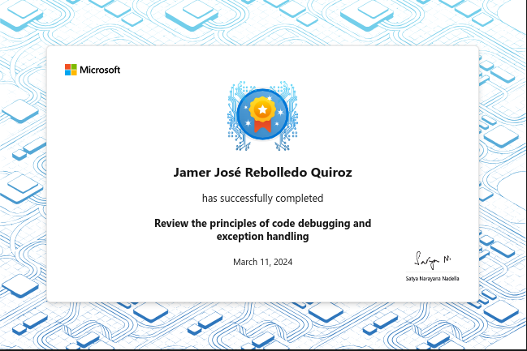

# Review the principles of code debugging and exception handling

Examine the code debugging process and the benefits provided by code debuggers,
and learn what an exception is and how exceptions are used in an application.

## Introduction

When you set out to develop an application, writing your code is just the first
step. The process for verifying that your code works as expected begins shortly
after the first lines of code are written. In software development, code
verification includes testing, debugging, and exception handling.

Suppose you're developing an application. Implementing the logic for certain
features turns out to be more complex than you expected. You're able to build
and run the code, but you're seeing unexpected results and it's difficult to
determine where the problems are being introduced. In addition, you've noticed
that passing user supplied data as a parameter for certain method calls can
result in runtime errors. If you don't find a better approach to debugging your
code logic and managing runtime errors, you might not complete the project on
time. When you ask colleague for advice, they remind you that Visual Studio Code
provides debugging tools and that C# includes support for exception handling.
You decide it's time for you to start learning about code debugging and
exception handling.

In this module, you learn the difference between testing, debugging, and
exception handling. You examine the code debugging process and the benefits
provided by code debuggers. You also learn about exceptions and how exceptions
are used in an application.

By the end of this module, you'll be able to explain the benefits of code
debuggers and exception handling.

### Learning objectives

In this module, you will:

- Review the responsibilities for software testing, debugging, and exception
  handling.
- Examine the code debugging process and the benefits provided by code debugger
  tools.
- Examine what an exception is and the options for managing exceptions in your
  code.


## Get started with testing, debugging, and exception handling

Every software developer needs to complete some level of testing and debugging
when they develop their code, and exception handling is often required. But how
are these three tasks related and when should they be implemented?

### Testing, debugging, and exception handling

Code debugging is clearly related to both code development and testing. After
all, you make corrections to your code logic as you develop your application,
and you also run your code periodically to verify that your code syntax and
logic are correct. But is updating code logic during the development process
really what's meant by debugging? And is verifying that your code builds and
runs really what's meant by testing? No, not really.

How does exception handling relate to code development and testing? In fact,
what does "exception handling" mean and is a developer expected to do it? In C#
development, the errors that occur during the application runtime (versus build
errors that occur during the build process) are referred to as exceptions, and
"exception handling" is the process that a developer uses to manage those
runtime exceptions within their code.

You may be wondering how exception handling relates to code development and
testing. In fact, what does "exception handling" mean and is a developer
expected to do it? In C# development, the errors that occur while the
application is running are referred to as exceptions. The term "exception
handling" refers to the process that a developer uses to manage those runtime
exceptions within their code. Errors that occur during the build process are
referred to as errors, and aren't part of the exception handling process.

The following sections describe the developer's role in testing, debugging, and
exception handling.

### Software testing and developer responsibilities

The software development process can involve a lot of testing. In fact, software
testing has its own specialized discipline, and software testers play an
important role in the development of large applications. There are even
approaches to the software development process that are based on testing, such
as test-driven development.

Software testing categories can be organized under the types of testing, the
approaches to testing, or a combination of both. One way to categorize the types
of testing is to split testing into Functional and Nonfunctional testing. The
functional and nonfunctional categories each include subcategories of testing.
For example, functional and nonfunctional testing could be divided into the
following subcategories:

- Functional testing - Unit testing - Integration testing - System testing -
  Acceptance testing
- Nonfunctional testing - Security testing - Performance testing - Usability
testing - Compatibility testing

Although most developers probably don't consider themselves to be testers, some
level of testing is expected before a developer hands off their work. When
developers are assigned a formal role in the testing process, it's often at the
level of unit testing.

### Code debugging and developer responsibilities

Code debugging is a process that developers use to isolate an issue and identify
one or more ways to fix it. The issue could be related to either code logic or
an exception. Either way, you work on debugging your code when it isn't working
the way you want it to. Generally speaking, the term debugging is reserved for
runtime issues that aren't easy to isolate. Therefore, fixing syntax issues such
as a missing ";" at the end of a code statement, isn't normally considered
debugging.

Consider the following sample code:

```csharp
string[] students = new string[] {"Sophia", "Nicolas", "Zahirah", "Jeong"};

int studentCount = students.Length;

Console.WriteLine("The final name is: " + students[studentCount]);
```

The code sample is intended to accomplish the following:

- Declare a string array named students. The students array contains the names
  of students.
- Declare an integer named studentCount. The code uses the Length method of the
  array to assign a value to studentCount.
- Print the name of the final student to the console. The code uses studentCount
  to access the final name in the students array, and it uses the
  Console.WriteLine() method to print the information to the console.

At first glance, everything seems fine. However, this code generates an
exception when attempting to print the student name to the console. The
developer forgot that arrays are zero-based. The final name in the array should
be accessed using `students[studentCount - 1]`.

Code debugging is definitely a developer responsibility. In this code sample,
you may have recognized the issue right away. However, in more complex coding
scenarios, finding an issue isn't always easy. Don't worry, there are tools and
approaches that you can use to track down issues that're hard to find.

### Exception handling and developer responsibilities

As you read earlier, errors that occur during the application runtime are
referred to as exceptions. If an application generates an exception, and that
exception isn't managed in code, it can result in the application being shut
down.

Handling exceptions is definitely a responsibility of the developer. C# provides
a way for you to "try" the code that you know might generate an exception, and a
way for you to "catch" any exceptions that do occur.

### Recap

Here are the key points to remember:

- Testing, debugging, and exception handling are all important tasks for
  software developers.
- Testing can be categorized into functional and nonfunctional testing, and
  developers are expected to perform some level of testing.
- Code debugging is the process of isolating issues and identifying ways to fix
  them, and it's a developer responsibility.
- Exception handling is the process of managing errors that occur during
  runtime, and developers are responsible for handling exceptions by using "try"
  and "catch" statements in their code.

## Examine the code debugger approach to debugging code

Every developer has to deal with code bugs, it's just a way of life for
developers. Sometimes you can spot your bugs quickly. After all, you wrote the
code, and besides, it feels good to find and fix an issue quickly. Inevitably
though, there will be times when you find yourself searching for a bug that
isn't so easy to spot.

### Code debugging process

When you notice a bug in your code, it can be tempting to try a direct approach.
You know, that quick scan where you think the issue might be. If it pays off in
the first 30 seconds, great, but don't let yourself be sucked in. Don't keep
going to that next spot, and the next. Don't let yourself throw time against the
following approaches:

- Reading through your code (just one more time) hoping that this time the issue
  jumps out at you.
- Breadcrumbing a few Console.WriteLine("here") messages in your code to the
  track progress through your app.
- Rerunning your app with different data. Hoping that if you see what works,
you'll understand what doesn't work.

You might have experienced various degrees of success with these methods, but
don't be fooled. There is a better way.

The one approach that's commonly regarded as being the most successful is using
a debugger. But what's a debugger exactly?

A debugger is a software tool used to observe and control the execution flow of
your program with an analytical approach. Debuggers help you isolate the cause
of a bug and help you resolve it. A debugger connects to your code using one of
two approaches:

- By hosting your program in its own execution process.
- By running as a separate process that's attached to your running program.

Debuggers come in different flavors. Some work directly from the command line
while others come with a graphical user interface. Visual Studio Code integrates
debugger tools in the user interface.

### Why use a debugger?

If you're not running your code through a debugger, you're probably guessing at
what's happening in your application at runtime. The primary benefit of using a
debugger is that you can watch your program running. You can follow program
execution one line of code at a time. This approach minimizes the chance of
guessing wrong.

Visual Studio Code supports code debuggers that enable you to watch your code as
it runs. The following image shows a running application, with execution paused
on the line of code that's highlighted. The right side of the screen shows the
program code, while the left side shows the current state of variables.


Every debugger has its own set of features. The two most important features that
come with almost all debuggers are:

- Control of your program execution. You can pause your program and run it step
  by step, which allows you to see what code is executed and how it affects your
  program's state.

- Observation of your program's state. For example, you can look at the value of
  your variables and function parameters at any point during your code
  execution.

Mastering the use of a code debugger is an important skill. Unfortunately, it's
a skill that developers often overlook. Effective use of a debugger helps you to
be more efficient at hunting bugs in your code. Debuggers can also help you to
understand how a program works.

### Recap

Here are the key points to remember:

- Code debugging is a crucial skill in the software development process that
  every developer learns.
- The best approach to debugging your applications is to use a debugger, not
  rereading your code five times or adding console.WriteLine() statements
  throughout your code.
- Debuggers enable you to pause your application, step through your code
line-by-line, and observe the state of variables and function parameters.

## Examine exceptions and how exceptions are used

Earlier in this module you learned that runtime errors in C# are called
exceptions and that you need to "catch" them before they crash your application.
Really? Catching exceptions before they can crash your application sounds more
like a video game than writing an application. So what exactly does it mean to
"catch" an exception? To answer that question, you need to start by taking a
closer look at what an exception is.

### What are exceptions?

Here is a more formal definition that describes what an exception is and how an
exception is used in a C# application:

> *In C#, errors in the program at runtime are propagated through the program by
> using a mechanism called exceptions. Exceptions are thrown by code that
> encounters an error and caught by code that can correct the error. Exceptions
> can be thrown by the .NET runtime or by code in a program. Exceptions are
> represented by classes derived from Exception. Each class identifies the type
> of exception and contains properties that have details about the exception.*

Microsoft's documentation on exceptions goes into great detail. However, this
definition provides the information that you need right now. Specifically, you
need to understand two things:

- You need to understand what exceptions are.
- You need to understand how to use exceptions in your applications.

You can think of an exception as a variable that has extra capabilities. You can
do the same type of things with exceptions that you do with variables, for
example:

- You can create different types of exceptions.
- You can access the contents of an exception.

### What does it mean to "throw" and "catch" an exception?

The terms "throw" and "catch" can be explained by evaluating the definition of
an exception.

The second sentence of the definition says "Exceptions are thrown by code that
encounters an error and caught by code that can correct the error". The first
part of this sentence tells you that exceptions are created by the .NET runtime
when an error occurs in your code. The second part of the sentence tells you
that you can write code to catch an exception that's been thrown. In addition,
the code that catches the exception can be used to complete a corrective action,
hopefully mitigating the situation caused by the code that resulted in the
error. In other words, you can write code that protects your application when an
error occurs.

After evaluating that second sentence of the definition, you know the following:

- An exception gets created at runtime when your code produces an error.
- The exception can be treated like a variable that has some extra capabilities.
- You can write code that accesses the exception and takes corrective action.

The remaining portion of the definition tells you that if the .NET runtime
detects an error, it generates the exception. The exception that's generated
contains information about the error that occurred. Your code can catch an
exception and correct the issue using the information stored in the exception.

### Recap

Here are the key points to remember:

- Exceptions are used in C# to propagate errors at runtime, and are represented
  by classes derived from the Exception class.
- Exceptions are thrown by code that encounters an error and caught by code that
  can correct the error.
- When an exception is caught, code can access its contents and take corrective
  action to mitigate the error.
- The .NET runtime generates exceptions when it detects an error and the
  exception contains information about the type of error that occurred.

## Summary

Your goal was to learn about the code debugging and exception handling
processes.

By examining the code debugging and exception handling processes, you learned
about the tools and mechanisms that enable the processes to work. You learned
what a code debugger does and the benefits provided by using a code debugger.
You also learned about the relationship between errors and exceptions, and how
exceptions are thrown and caught during code execution.

Without the conceptual knowledge that you've gained, you wouldn't be prepared to
start using code debugging and exception handling in your C# applications.

## Achievement


