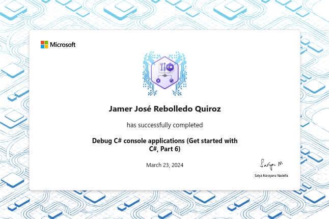

# Debug C# Console Applications

Sharpen your troubleshooting skills as you dive into the world of debugging C# console applications. Gain the ability to identify and fix issues in your code, ensuring your applications run smoothly and deliver the desired results.

## Modules

- [X] Review the Principles of Code Debugging and Exception Handling
- [X] Implement the Visual Studio Code Debugging Tools for C#
- [X] Implement Exception Handling in C# Console Applications
- [X] Create and Throw Exceptions in C# Console Applications
- [X] Guided Project - Debug and Handle Exceptions in a C# Console Application
  Using Visual Studio Code
- [X] Challenge Project - Debug a C# Console Application Using Visual Studio
  Code
- [X] Trophy - Debug C# Console Applications

