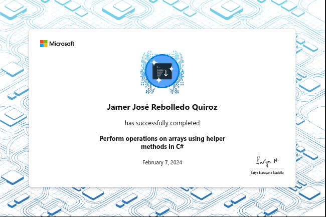

# Perform operations on arrays using helper methods in C\#

Use powerful helper methods to manipulate and control the content of arrays.

## Introduction

Suppose you are a software developer on a team assigned to work with a logistics
company. They have many needs for gathering and organizing their business data.
Projects vary from tracking and reporting inventory, enabling specific data to
be passed to and from business partners, and identifying possible fraudulent
orders. Each project is different, but all require the processing of data. In
these projects the applications will be performing data operations such as add,
delete, sort, combine, calculate, validate and format output.

In this module, you'll use C# arrays to allow you to store sequences of values in a single data structure. Once you have data in an array, you can manipulate the order and the contents of the array. Furthermore, you'll be able to perform powerful string operations using array helper methods.

With the use of several helper methods, you'll sort the data or reverse the order of the data. You'll clear out the items in the array and resize the array to add new items. You'll convert a string into an array by splitting it into smaller strings each time you encounter a character like a comma. You'll also split a string into an array of characters. Finally, you'll join all of the elements of an array into a single string.

### Learning objectives

In this module, you will:

- Sort and reverse the order of array elements
- Clear and resize arrays
- Split a `string` into an array of strings or characters (`char`s)
- Join the elements of an array into a single `string`

## Exercise 1 - Discover Sort() and Reverse() methods

The `Array` class contains methods that you can use to manipulate the content, arrangement, and size of an array. In this exercise, you'll write code that performs various operations on an array of pallet identifiers. Your code could be the start of an application to track and optimize the usage of pallets for the company.

### Code

[C#](./Exercises/Exercise1/Program.cs)

### Recap

Here's a few important ideas that you covered in this unit:

- The Array class has methods that can manipulate the size and contents of an array.
- Use the `Sort()` method to manipulate the order based on the given data type of an array.
- Use the `Reverse()` method to reverse the order of the elements in an array.

## Exercise 2 - Discover Clear() and Resize() methods

As you continue building a pallet tracker for the logistics company, suppose you also need track new pallets and remove old pallets from tracking. How can you accomplish creating tracking functionality for adding and removing pallets?

### Code

[C#](./Exercises/Exercise2/Program.cs)

## Exercise 3 - Discover Split() and Join() methods

As you continue your development work for a logistics company, you will be building a series of small applications. Combined, the applications take data from one partner's system, modify the data, then pass it to an internal system in the format it requires.

To perform this transformation on the data, you'll need to accept incoming data as a string, parse it into smaller data elements, then manipulate it to match a different format. But how can you parse the string data into smaller data elements?

### String data type's Array methods

The variables of type `string` have many built-in methods that convert a single string into either an array of smaller strings, or an array of individual characters.

When processing data from other computer systems, sometimes it's formatted or encoded in a way that's not useful for your purposes. In those cases, you can use the string data type's Array methods to parse a larger `string` into an array.

### Code

[C#](./Exercises/Exercise3/Program.cs)

### Recap

Here's a few important ideas that you covered in this unit:

- The `Split()` method can be used to convert a `string` into an array of smaller strings.
- The `Join()` method can be used to convert an array of strings into a single `string`.
- The `ToCharArray()` method can be used to convert a `string` into an array of individual characters.

## Exercise 4 - Complete a challenge to reverse words in a sentence

Write code to reverse each word in a message

### Code

[C#](./Exercises/Exercise4/Program.cs)

## Exercise 5 - Complete a challenge to parse a string of orders, sort the orders and tag possible errors

Data comes in many formats. In this challenge you have to parse the individual "Order IDs", and output the "OrderIDs" sorted and tagged as "Error" if they aren't exactly four characters in length.

### Code

[C#](./Exercises/Exercise5/Program.cs)

## Summary

In this module, you learned how to use helper methods to manipulate and control the content of arrays. You used the `Sort()` and `Reverse()` methods to manipulate the order of the elements in an array. You used the `Clear()` and `Resize()` methods to manipulate the size of an array. You used the `Split()` method to convert a `string` into an array of smaller strings. You used the `Join()` method to convert an array of strings into a single `string`. You also used the `ToCharArray()` method to convert a `string` into an array of individual characters.

The array helper methods allowed you to work flexibly with data in the applications. Without these features, arrays would be less useful.

## Achievement

