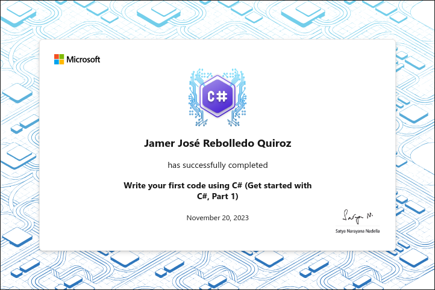
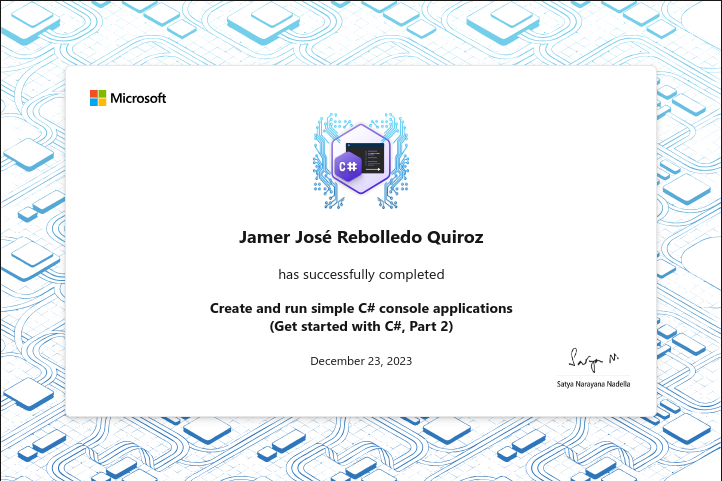
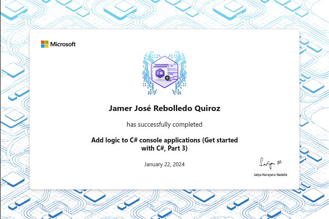
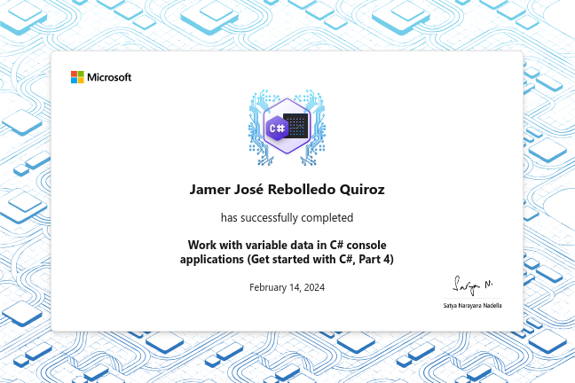

# Fundamentos de C# con Microsoft

Este curso ofrece una introducción completa a la programación en C#, cubriendo
sus conceptos fundamentales, sintaxis y aplicación práctica en el desarrollo de
software.

A través de ejercicios prácticos y proyectos, aprenderás los fundamentos de C#,
incluyendo variables, tipos de datos, estructuras de control y principios de
programación orientada a objetos.

Al final de este curso, habrás  adquirido las habilidades prácticas y el
conocimiento necesario para utilizar C# con confianza en la construcción de
aplicaciones.

## Contenido

### Escribe tu primer código usando C\#

Empieza tu viaje aprendiendo a escribir tu primer código usando C#. Desarrolla
una base sólida mientras exploras los fundamentos y la sintaxis del lenguaje,
preparando el escenario para tus aventuras de programación.

- [X] Escribe tu primer código usando C\#
- [X] Almacena y recupera datos usando valores literales y variables en C\#
- [X] Realiza formato básico de cadenas en C\#
- [X] Realiza operaciones básicas con números en C\#
- [X] Proyecto guiado - Calcula e imprime las calificaciones de los estudiantes
- [X] Proyecto guiado - Calcula el GPA final
- [X] Trofeo - Escribe tu primer código usando C\#

### Crea y ejecuta aplicaciones de consola de C\# simples

Dominar el arte de crear y ejecutar aplicaciones de consola de C# simples. Sumérgete
en el mundo de la programación basada en consola, donde obtendrás experiencia
práctica ejecutando tu código y viéndolo en acción.

- [X] Instala y configura Visual Studio Code para el desarrollo de C#
- [X] Llama a métodos de la biblioteca de clases .NET usando C#
- [X] Agrega lógica de decisión a tu código usando las instrucciones if, else y
  else if en C#
- [X] Almacena e itera a través de secuencias de datos usando matrices y la
  instrucción foreach en C#
- [X] Crea un código legible con convenciones, espacios en blanco y comentarios
  en C#
- [X] Proyecto guiado - Desarrolla estructuras de ramificación y bucle
  condicionales en C#
- [X] Proyecto de desafío - Desarrolla estructuras de ramificación y bucle en
  C#
- [X] Trofeo - Crea y ejecuta aplicaciones de consola de C# simples

### Agrega lógica a las aplicaciones de consola de C\#

Desbloquea el poder de la lógica en las aplicaciones de consola de C\#. Aprende
cómo agregar lógica y capacidades de toma de decisiones a tu código, lo que
permite que tus aplicaciones tomen decisiones dinámicas y respondan
inteligentemente a diferentes escenarios.

- [X] Evalúa expresiones booleanas para tomar decisiones en C\#
- [X] Controla el alcance de las variables y la lógica usando bloques de código
  en C\#
- [X] Ramifica el flujo de código usando la construcción switch-case en C\#
- [X] Itera a través de un bloque de código usando la instrucción for en C\#
- [X] Agrega lógica de bucle a tu código usando las instrucciones do-while y
  while en C\#
- [X] Proyecto guiado - Desarrolla estructuras de ramificación y bucle
  condicionales en C\#
- [X] Proyecto de desafío - Desarrolla estructuras de ramificación y bucle en
  C\#
- [X] Trofeo - Agrega lógica a las aplicaciones de consola de C\#

### Trabaja con datos de variables en aplicaciones de consola de C\#

Descubre la versatilidad de los datos de variables en aplicaciones de consola de
C\#. Aprovecha la capacidad de almacenar y manipular diferentes tipos de datos,
como números y texto, a medida que profundizas en los conceptos esenciales de
variables y manejo de datos.

- [X] Elije el tipo de datos correcto en tu código C\#
- [X] Convierte tipos de datos usando técnicas de conversión y conversión en C\#
- [X] Realiza operaciones en matrices usando métodos auxiliares en C\#
- [X] Dale formato a datos alfanuméricos para su presentación en C\#
- [X] Modifica el contenido de las cadenas usando métodos de tipo de datos de
  cadena incorporados en C\#
- [X] Proyecto guiado - Trabaja con datos de variables en C\#
- [X] Proyecto de desafío - Trabaja con datos de variables en C\#
- [X] Trofeo - Trabaja con datos de variables en aplicaciones de consola de C\#

### Crea métodos en aplicaciones de consola de C\#

Lleva tus aplicaciones de consola de C\# al siguiente nivel dominando el arte de
crear métodos. Aprende a organizar y modularizar tu código haciéndolo más
manejable, reutilizable y eficiente.

- [X] Escribe tu primer método C\#
- [X] Crea métodos C\# con parámetros
- [X] Crea métodos C\# que devuelvan valores
- [X] Proyecto guiado - Planifica una visita al zoológico de mascotas
- [X] Proyecto de desafío - Crea un mini-juego
- [X] Trofeo - Crea métodos en aplicaciones de consola de C\#

### Depura aplicaciones de consola de C\#

Afina tus habilidades de solución de problemas mientras te sumerges en el mundo
de la depuración de aplicaciones de consola de C\#. Adquiere la capacidad de
identificar y solucionar problemas en tu código, asegurando que tus aplicaciones
funcionen sin problemas y entreguen los resultados deseados.

- [X] Revisa los principios de depuración de código y manejo de excepciones
- [X] Implementa las herramientas de depuración de código de Visual Studio para
  C\#
- [X] Implementa el manejo de excepciones en aplicaciones de consola de C\#
- [X] Crea y lanza excepciones en aplicaciones de consola de C\#
- [X] Proyecto guiado - Depura y maneja excepciones en una aplicación de consola
  de C\# usando Visual Studio Code
- [ ] Proyecto de desafío - Depura una aplicación de consola de C\# usando
  Visual Studio Code
- [ ] Trofeo - Depura aplicaciones de consola de C\#

### Fundamentos de C# con Microsoft - Examen de certificación

Utiliza lo que has aprendido para aprobar el examen y obtener tu certificación
de Fundamentos de C# con Microsoft.

- [ ] Examen de certificación de Fundamentos de C# con Microsoft

## Referencias y recursos

- [Announcing the New Foundational C# Certification with
  freeCodeCamp](https://devblogs.microsoft.com/dotnet/announcing-foundational-csharp-certification/)
- [C# for Visual Studio
  Code](https://marketplace.visualstudio.com/items?itemName=ms-dotnettools.csharp)
- [IntelliCode for C# Dev Kit (Visual Studio Code
  Extension)](https://marketplace.visualstudio.com/items?itemName=ms-dotnettools.vscodeintellicode-csharp)
- [.NET Documentation](https://learn.microsoft.com/en-us/dotnet/?view=net-8.0)
- [Basic writing and formatting syntax - GitHub
  Docs](https://docs.github.com/en/get-started/writing-on-github/getting-started-with-writing-and-formatting-on-github/basic-writing-and-formatting-syntax)
- [Foundational C# with Microsoft - freeCodeCamp &
  Microsoft](https://www.freecodecamp.org/learn/foundational-c-sharp-with-microsoft)
